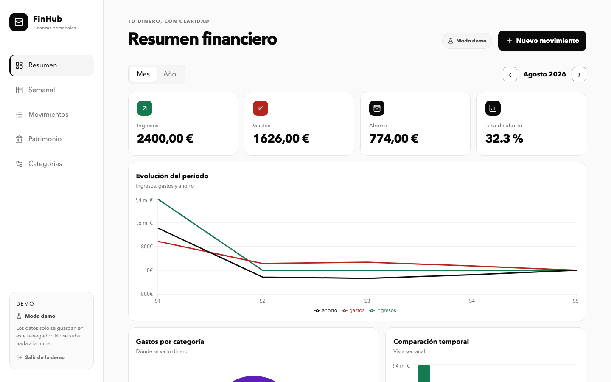
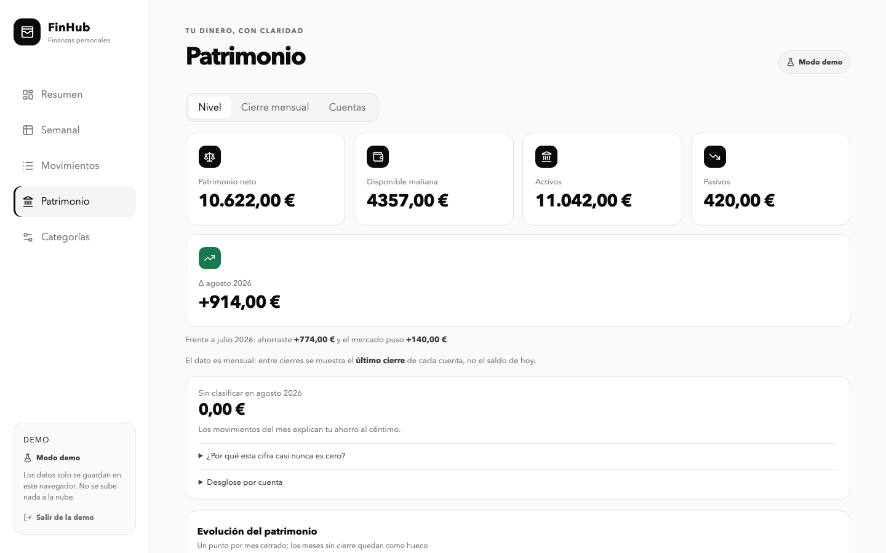
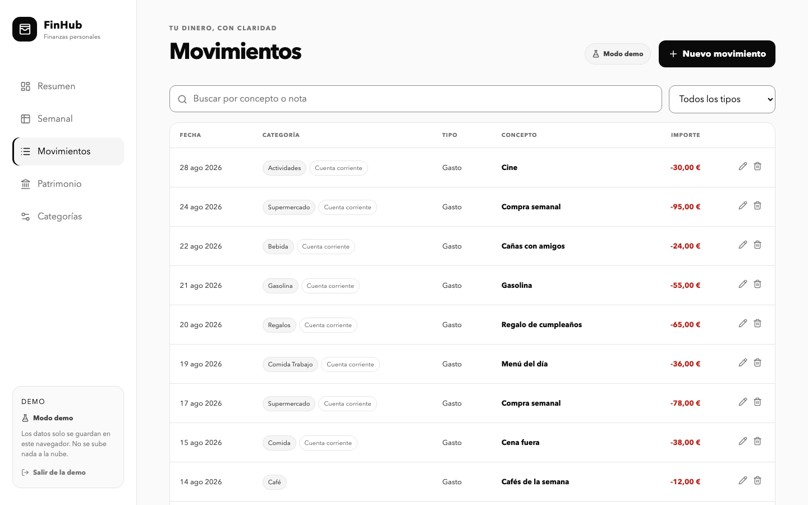
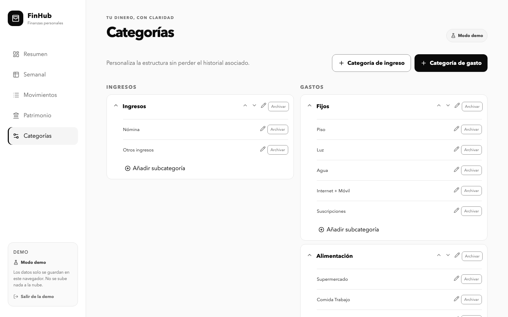

# FinHub · Finanzas personales

App web de finanzas personales para un único usuario: registra ingresos y gastos, cierra el mes de
cada cuenta para saber cuánto patrimonio tienes de verdad, y todo sigue funcionando aunque se caiga la
conexión — porque cada escritura pasa primero por el dispositivo y solo después viaja al servidor.

No es un CRUD de gastos más. El interés real está en lo que hace falta para que **un solo usuario, en
varios dispositivos, sin conexión garantizada,** nunca pierda ni duplique un dato: un motor de
sincronización con resolución de conflictos, lápidas para que un borrado no resucite, y una huella que
evita descargar nada cuando el servidor no ha cambiado.

## 🔗 Probarla

**[fin-hub-tau.vercel.app](https://fin-hub-tau.vercel.app)**

La app exige login (es de un solo usuario), pero el botón **"Probar la demo"** del login —o la URL
`?demo=1`— abre la aplicación completa con datos de ejemplo, **sin crear cuenta y sin tocar
producción**: corre sobre una base de datos local aparte, con la sincronización apagada. Es la forma
más rápida de ver el proyecto funcionando.

## Capturas

| Resumen | Patrimonio |
|---|---|
|  |  |

| Movimientos | Categorías |
|---|---|
|  |  |

## Qué hace

- **Movimientos**: ingreso o gasto, con importe, fecha, categoría, subcategoría, concepto y notas.
  Búsqueda y filtro por tipo.
- **Categorías y subcategorías** propias, organizables y **archivables** — nunca se borran, para no
  romper el histórico de movimientos antiguos que ya las usan.
- **Resumen del periodo** (mes o año): ingresos, gastos, ahorro y tasa de ahorro, con gráfico de
  tendencia y de reparto por categoría (agrupación automática de categorías minoritarias en "Otros").
- **Vista semanal** con desglose de gasto por semana natural.
- **Patrimonio**: la dimensión que un simple registro de flujos no puede dar.
  - Cuentas (activo/pasivo, líquida o de inversión) y un **cierre mensual**: una foto del saldo real de
    cada cuenta, no un saldo derivado de sumar movimientos (ver [por qué, más abajo](#la-foto-manda-patrimonio-como-snapshot-no-como-suma)).
  - Patrimonio neto y su evolución mes a mes, y cuánto hay **disponible mañana** sin vender nada.
  - El delta mensual separado en **ahorro real** y **rentabilidad** (en euros, no en porcentaje).
  - El **"sin clasificar"**: la diferencia entre lo que dicen los saldos y lo que explican los
    movimientos, con desglose por cuenta — tratado como diagnóstico, no como error.
  - Vinculación opcional de un movimiento a una cuenta, sin romper ningún agregado existente.
- **Sincronización multi-dispositivo** con resolución de conflictos, funcionamiento sin conexión, y un
  indicador que dice en todo momento si hay algo pendiente de subir.
- **Modo demo** para probar la app entera sin cuenta ni riesgo (ver arriba).
- Accesibilidad cuidada: un único indicador de foco, `aria-live` para avisos, confirmación doble para
  "Borrar todo", diálogos de confirmación propios (nunca el `confirm()` nativo).
- **Instalable** como PWA (icono y pantalla completa en el móvil); los datos funcionan offline vía
  IndexedDB, aunque el *shell* de la app todavía necesita red para cargar (no hay service worker).

## Por qué es interesante (arquitectura)

### El motor de sync: local-first con conflictos resueltos de verdad

**IndexedDB es la caché y la cola offline; Supabase (Postgres) es la fuente de verdad.** El dato se
escribe siempre primero en local — así la app nunca depende de la red para guardar — y una cola
(`outbox`) lo sube en cuanto hay conexión, respetando el orden en que se escribió (importa: una
categoría tiene que llegar antes que el movimiento que la usa).

Cuando dos dispositivos tocan lo mismo sin haber sincronizado entre medias, gana el sello más
reciente (*last-write-wins*), con varias garantías poco obvias para que eso sea seguro:

- Cada escritura recibe un timestamp **monótono** por dispositivo — si el reloj del sistema se
  atrasara, la escritura seguiría avanzando igualmente.
- Un movimiento borrado deja una **lápida** en el servidor: un upsert que llegue tarde desde un
  dispositivo offline no lo resucita.
- **"Borrar todo" no se puede repoblar por accidente**: purga también las lápidas y sube un
  `wipe_epoch` que invalida cualquier cola vieja que intente subir después.
- El **pull solo ocurre con la cola local vacía**, y lo pendiente se reaplica encima del snapshot del
  servidor — en pantalla manda lo que el usuario acaba de escribir, no lo último que bajó.

La pieza más reciente es la **huella de sincronización**: en vez de sondear el servidor cada minuto y
traer las cinco tablas enteras cada vez, un RPC (`sync_fingerprint`) calcula un digest sobre
`(id, updated_at)` de todo lo tuyo, y el cliente solo hace el pull completo si ese digest cambió desde
la última vez. Un simple `count() + max(updated_at)` puede quedarse ciego si un dispositivo escribe con
el reloj adelantado; el digest, no. El ciclo de sondeo en reposo pasa de 6 peticiones a 1.

### Seguridad tomada en serio, no como checklist

- **RLS activa en las 7 tablas**, con políticas separadas por operación y `WITH CHECK` explícito.
- El RPC de la huella es `security invoker`, no `definer`: corre con los permisos de quien llama, así
  que nunca puede convertirse en un oráculo que revele si existen datos de otro usuario.
- `revoke all` + *grants* mínimos por tabla y por función — incluye un hallazgo real que se corrigió:
  `anon` conservaba `EXECUTE` en varias funciones porque solo se había revocado de `PUBLIC`, no del rol
  concreto.
- `search_path = ''` en todas las funciones, y las `SECURITY DEFINER` que existen filtran siempre por
  `user_id` y no reciben ningún identificador como parámetro (`wipe_all_data()` no acepta argumentos,
  precisamente para que no se pueda apuntar a un usuario ajeno).
- Sin registro público: un único usuario propietario, dado de alta a mano.

### La "foto manda": Patrimonio como snapshot, no como suma

Hay dos formas de saber el saldo de una cuenta. **Derivada** (saldo inicial + suma de todos los
movimientos) cuadra siempre por construcción, y por eso miente: si un día se te olvida registrar un
gasto, el saldo queda mal para siempre y nada te avisa. **Foto mensual** (cada mes escribes el saldo
real) nunca se desalinea de la realidad, porque la realidad es el dato de entrada — los movimientos
pasan a *explicar* el cambio, no a *definirlo*. FinHub elige la foto, y la diferencia entre lo que dice
la foto y lo que suman los movimientos —el "sin clasificar"— se convierte en la funcionalidad más
valiosa del módulo en vez de en un bug.

### Documentación como vault de Obsidian, no como comentarios sueltos

[`docs/`](./docs/00-index.md) es un vault de Obsidian con la arquitectura completa: notas de dominio,
decisiones (ADR) con su contexto y sus alternativas descartadas, flujos con diagramas Mermaid, y la
referencia del esquema de Postgres. Nace de una necesidad concreta: `sync.ts` tiene más de 500 líneas y
el esquema SQL, más de 500 también — releerlos enteros cada vez que hay que tocar algo no escala, ni
siquiera para el propio autor. El vault se mantiene junto con el código (cada PR que cambia un patrón
actualiza su nota), y cuando el código y una nota discrepan, gana el código.

Abrir el vault: *Open folder as vault* en Obsidian → seleccionar `docs/`. Punto de entrada:
[`docs/00-index.md`](./docs/00-index.md).

## Stack

| Capa | Tecnología |
|---|---|
| UI | React + TypeScript + Vite |
| Gráficos | Recharts (carga diferida con `lazy()`) |
| Datos locales | IndexedDB vía [`idb`](https://github.com/jakearchibald/idb) — caché + cola offline |
| Backend | Supabase (Postgres + Auth + RPC), con RLS como única puerta de acceso a los datos |
| Fechas | date-fns |
| Iconos | lucide-react |
| Tests | Vitest + Testing Library + `fake-indexeddb` |
| Calidad | ESLint · GitHub Actions (test · lint · build) |
| Deploy | Vercel, con deploy automático al mergear a `main` |

## Puesta en marcha

Requiere Node.js 22 (`.nvmrc`; con `nvm`: `nvm use`) y un proyecto de Supabase propio — el login es
obligatorio incluso para desarrollar en local, aunque el modo demo no necesite una cuenta creada en él.

```bash
npm install
cp .env.example .env.local   # rellenar VITE_SUPABASE_URL y VITE_SUPABASE_ANON_KEY
npm run dev
```

Cómo dar de alta el único usuario permitido y configurar el proyecto de Supabase:
[`docs/modules/supabase-auth.md`](./docs/modules/supabase-auth.md).

Para una versión de producción:

```bash
npm run build        # incluye el type-check (tsc -b)
npx vite preview      # sirve el build; "npm run preview" no existe como script
```

## Comprobaciones

```bash
npm test             # vitest run — 14 ficheros, con especial cobertura en calculations.ts y sync.ts
npm run lint
npm run build
```

Comprobación completa antes de dar algo por terminado: `npm test && npm run lint && npm run build`.
En CI (`.github/workflows/ci.yml`) corren las tres en cada PR y en cada push a `main`, pero son un
**semáforo, no una puerta**: un test en rojo no bloquea el deploy, solo lo avisa — el detalle y el
porqué en [`docs/reference/deploy-vercel.md`](./docs/reference/deploy-vercel.md).

## Privacidad

- Sin backend propio más allá de Supabase; sin telemetría ni terceros.
- Los movimientos y datos reales no forman parte del repositorio.
- Solo existe el usuario propietario: no hay registro público ni recuperación de contraseña por
  correo (se gestiona a mano desde el dashboard de Supabase).
- La opción **Borrar todo** requiere dos confirmaciones y restaura las categorías originales.

## Documentación

Detalles de arquitectura, patrones a respetar y comandos completos para quien vaya a tocar el código:
[`CLAUDE.md`](./CLAUDE.md). La documentación en profundidad —módulos, dominios, flujos con diagramas,
decisiones de arquitectura y checklist de seguridad— vive en el vault de [`docs/`](./docs/00-index.md).
