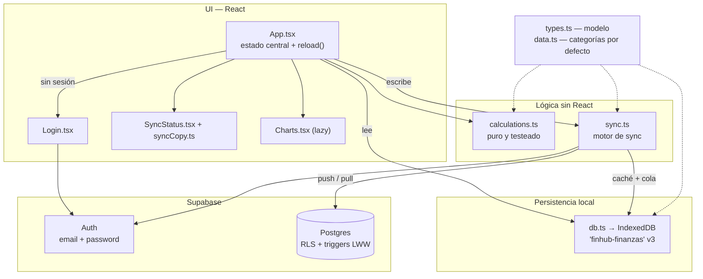

# Arquitectura general

FinHub es una app web de finanzas personales **para un único usuario** (el propietario). Nació
*local-first* —todo en IndexedDB, sin backend ni cuentas— y hoy está a mitad de una migración
consciente a Supabase para poder usarla desde varios dispositivos. Ver [[001-local-first-a-supabase]].

**La frase que resume el modelo actual**: *se escribe siempre primero en local, así que la app
funciona sin conexión; **Supabase es la fuente de verdad** y además **la puerta de acceso** — sin
iniciar sesión no se puede usar la app.*

Con una excepción acotada: el **modo demo** deja probarla sin cuenta, en una base de IndexedDB aparte y
con el motor de sync apagado. No es una segunda forma de usar la app, es un escaparate aislado
→ [[010-modo-demo]].

**Fuente de verdad**: `src/*` · `supabase/migrations/20260808133140_schema.sql` · `README.md`

## Estado por fases

| Fase | Qué añade | Estado |
|---|---|---|
| 1 | App local-first sobre IndexedDB (modelo, cálculos, UI, gráficos) | ✅ |
| 2 | Esquema Postgres con RLS y LWW + IndexedDB v3 (stores `outbox`/`meta`) | ✅ |
| 3 | Login obligatorio con email y contraseña, un único usuario | ✅ |
| 4 | Motor de sync (push/pull, resolución de conflictos *last-write-wins*) | ✅ |
| 5 | Indicador de estado de sincronización en la interfaz | ✅ |
| 6 | Deploy en Vercel + CI en GitHub Actions, instalable en el móvil | ✅ |

## Capas

## Flujo de datos, de abajo arriba

- **`src/types.ts`** — `Movement`, `Category` (con subcategorías embebidas), `Preferences`, `OutboxOp`,
  `SyncMeta`, `SyncState`. Fuente única del modelo del cliente.
- **`src/data.ts`** — árbol de categorías por defecto generado desde `expenseGroups` con un `slug()`
  que produce IDs estables. Ojo: cambiar un nombre ahí cambia el ID → ver [[categorias]].
- **`src/db.ts`** — única capa de acceso a IndexedDB. → [[db]]
- **`src/sync.ts`** — el motor: sella escrituras, encola, sube, baja y mezcla. → [[sync]]
- **`src/supabase.ts`** — cliente y sesión. → [[supabase-auth]]
- **`src/calculations.ts`** — toda la lógica derivada, pura y sin React. → [[calculations]]
- **`src/Charts.tsx`** — solo presentación con recharts, en `lazy()`. → [[charts]]
- **`src/App.tsx`** — el resto de la UI. → [[ui-app]]

## Las tres reglas de oro del proyecto

1. **Escribir → `reload()`**. El ciclo es siempre: escribir (IndexedDB + outbox) → `await reload()`,
   que re-lee *todo* con `getAllData()`. Sin estado optimista ni caché. Es deliberadamente tonto y
   correcto para este volumen. → [[ui-app]]
2. **Las lecturas van por `db.ts`, las escrituras por `sync.ts`**. Las funciones `*Synced` guardan en
   local **y** encolan la subida. Las preferencias son la excepción: no se sincronizan. → [[preferencias]]
3. **Las categorías se archivan, nunca se borran.** Los movimientos guardan `categoryId` como string,
   así que archivar es lo que preserva el histórico. → [[categorias]]

Related: [[sync-model]] · [[postgres-schema]] · [[glossary]]
