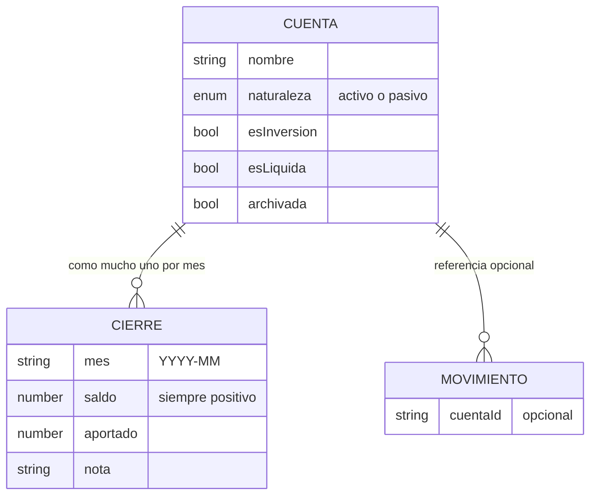
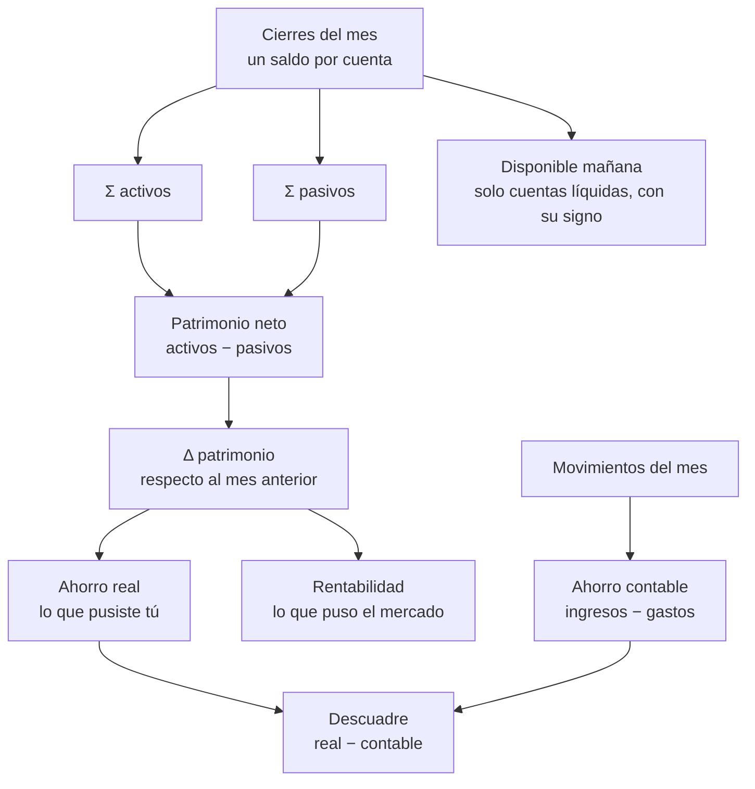

# Dominio: patrimonio

> ⚠️ **Parcialmente implementado.** El modelo, el esquema (Postgres + IndexedDB v4) y el sync de
> cuentas y cierres ya existen (fase F1a); las decisiones grandes están extraídas en
> [[009-la-foto-manda-cierre-mensual]]. La UI, los cálculos derivados y la vinculación de movimientos
> llegan en las fases F1b-F4. Las secciones aún no implementadas siguen siendo diseño.

La app registra hoy **flujos**: gastos e ingresos con sus categorías, porcentajes y gráficos. No sabe
**cuánto dinero existe** ni dónde está. Este dominio añade la dimensión que falta: **saldo**.

**Fuente de verdad**: para el esquema y el sync, el código (`supabase/migrations/*_patrimonio.sql`,
`src/db.ts`, `src/sync.ts` → [[postgres-schema]] · [[indexeddb-stores]] · [[sync]]); para lo demás,
este documento.

## 1. Contexto

La aplicación registra hoy flujos. Este módulo añade la dimensión de **saldo**: cuánto hay en cada cuenta
bancaria y en el broker, cómo evoluciona el patrimonio en el tiempo, y qué parte de esa evolución viene
del ahorro y qué parte del mercado.

**Restricción de partida:** toda la entrada de datos es **manual**. No hay integración bancaria ni API de
broker. El diseño se optimiza para que el mantenimiento mensual cueste menos de dos minutos.

Esa restricción no es un detalle de implementación, es **la que decide el modelo entero**. Un diseño que
exija registrar el 100 % de los movimientos para que el saldo sea correcto no se mantiene tres meses. De
ahí la decisión de la sección 3.

## 2. Objetivos

1. Saber el patrimonio neto actual y su evolución mensual.
2. Saber cuánto dinero es disponible mañana sin vender nada.
3. Separar el **ahorro** de la **rentabilidad** en la variación del patrimonio.
4. Vincular los movimientos existentes a una cuenta, sin romper los agregados actuales.

### No objetivos

- Posiciones individuales del broker (tickers, cantidades, precios de entrada). El broker se trata como
  **caja negra**: un valor y un aportado.
- Importación de CSV, agregación bancaria PSD2, sincronización automática.
- Granularidad diaria.
- Rentabilidad ponderada por tiempo (XIRR). Se evalúa más adelante.

## 3. La decisión de partida: la foto manda

Hay dos formas de saber el saldo de una cuenta, y son incompatibles:

| Enfoque | Cómo funciona | Por qué se descarta / se elige |
|---|---|---|
| **Derivado** | Saldo inicial + suma de todos los movimientos. | Cuadra siempre **por construcción**, y por eso miente: si olvidas un gasto, el saldo queda mal **para siempre** y nada te avisa. Exige registrar el 100 %. Incompatible con los dos minutos. |
| **Foto mensual** ✅ | Cada mes escribes el saldo real de cada cuenta. | Nunca se desalinea de la realidad, porque la realidad es el dato de entrada. Los movimientos **explican** el cambio, no lo definen. |

**Se elige la foto.** La consecuencia importante es que las dos fuentes —saldos y movimientos— pueden no
coincidir, y esa diferencia deja de ser un problema para convertirse en la funcionalidad más valiosa del
módulo. Ver la sección 6.

## 4. El modelo

### Cuenta

Un contenedor de dinero. Lo que hay que entender no es la lista de campos, sino **qué decide cada uno**:

| Atributo | Qué decide | Ejemplos |
|---|---|---|
| **Naturaleza** (activo / pasivo) | El signo con el que entra en el patrimonio. **Nunca lo teclea la persona.** | Corriente y broker son activos; hipoteca y tarjeta son pasivos. |
| **Es de inversión** | Si su valor puede moverse *sin que tú metas dinero*. Solo a estas se les pregunta el aportado. | Broker sí; cuenta de ahorro no. |
| **Es líquida** | Si cuenta para el *"disponible mañana"*. Aplica a activos **y** a pasivos. | Corriente sí, tarjeta sí (resta), broker no, hipoteca no. |
| **Archivada** | Las cuentas **se archivan, nunca se borran**, porque los cierres históricos las referencian. | Mismo patrón y misma razón que las categorías → [[005-categorias-se-archivan]] |

El invariante central está tomado prestado de [[movimientos]], donde ya lleva tiempo funcionando: **el
importe nunca es negativo; el signo lo da el tipo**. Aquí el signo lo da la naturaleza de la cuenta. Se
teclea *"debo 84.300"* en positivo y la app lo resta. Esto elimina de raíz el error de entrada manual más
probable —un pasivo tecleado en negativo que dispara el patrimonio— sin necesidad de validación alguna.

Fíjate en que **"es líquida" hace dos trabajos con un solo interruptor**: suma la corriente y resta la
tarjeta, ignorando el broker y la hipoteca. No hace falta un segundo atributo de "exigible a corto plazo".

### Cierre

El valor de **una cuenta** en **un mes**. El grano es la pareja `(cuenta, mes)`, con el mes en formato
`YYYY-MM`. No hay granularidad diaria, y eso es un no objetivo, no una limitación pendiente.

- **Saldo** — siempre positivo. El signo ya lo puso la cuenta.
- **Aportado** — dinero *propio* que entró en esa cuenta ese mes. Solo se pregunta en cuentas de
  inversión, porque en el resto es deducible de los movimientos. Es el único dato que permite separar
  ahorro de rentabilidad, y es un número al mes.
- **Nota** — opcional, para acordarte de por qué ese mes fue raro.

> ⚠️ **"Snapshot" no se puede usar como nombre.** En este proyecto ya significa *"el estado completo del
> servidor"* → [[glossary]]. De ahí **cierre**.

## 5. Las cifras derivadas

Todo lo que ve la persona se calcula desde los cierres. Nada se guarda calculado.

| Cifra | Definición | Objetivo que cubre |
|---|---|---|
| **Patrimonio neto** | Σ activos − Σ pasivos | 1 |
| **Disponible mañana** | Σ cuentas líquidas, con su signo | 2 |
| **Ahorro real** | Variación de las cuentas no de inversión + aportado a las de inversión | 3 |
| **Rentabilidad del mes** | Saldo final − saldo inicial − aportado, en cada cuenta de inversión | 3 |
| **Descuadre** | Ahorro real − ahorro contable | (lo que hace fiable todo lo demás) |

### Sobre la rentabilidad: euros, no porcentaje

Se muestra en **euros ganados**, y es una decisión, no una simplificación pendiente. El porcentaje ingenuo
—ganancia dividida entre lo aportado— miente cuando las aportaciones se concentran en el tiempo: aportar
en diciembre y en enero no es lo mismo, y ese número no lo distingue. Es además el número que uno se ve
tentado de comparar con un índice, que es exactamente la comparación que no soporta.

Lo honesto de afirmar con esta cifra es *"el mercado me dio 200 € este mes"*. Lo que **no** se puede
afirmar es *"llevo un 8 % anual"*. Para eso hace falta XIRR, que es no objetivo hoy.

## 6. La identidad que sostiene el módulo

> **Δ patrimonio = ahorro + rentabilidad**

Un ejemplo completo, porque explica el modelo entero mejor que cualquier definición. Mes de marzo:

| Cuenta | Naturaleza | Cierre feb | Cierre mar | Aportado en mar |
|---|---|---|---|---|
| Corriente | activo | 10.000 | 9.500 | — |
| Broker | activo, de inversión | 5.000 | 6.200 | 1.000 |
| Hipoteca | pasivo | 100.000 | 99.700 | 0 |

Movimientos registrados en marzo: **2.000 de ingresos** y **1.500 de gastos**, de los cuales 400 son la
cuota de la hipoteca.

| Cifra | Cálculo | Resultado |
|---|---|---|
| Patrimonio neto (feb) | 10.000 + 5.000 − 100.000 | **−85.000** |
| Patrimonio neto (mar) | 9.500 + 6.200 − 99.700 | **−84.000** |
| Δ patrimonio | −84.000 − (−85.000) | **+1.000** |
| Rentabilidad | 6.200 − 5.000 − 1.000 | **+200** |
| Ahorro real | −500 (corriente) + 300 (menos deuda) + 1.000 (aportado) | **+800** |
| **Comprobación** | 800 + 200 | **= 1.000** ✅ |
| Ahorro contable | 2.000 − 1.500 | **+500** |
| Descuadre | 800 − 500 | **+300** |

Los 1.000 € que salieron de la corriente hacia el broker **no aparecen por ningún lado como ahorro
extra**: bajan la corriente y suben el aportado, y se cancelan. Eso es justo lo que se busca — mover
dinero de sitio no te hace más rico.

### El descuadre de este ejemplo no es un error

Son **exactamente los 300 € de principal amortizado de la hipoteca**. Contablemente pagaste 400 € de
gasto; en la realidad, 100 € fueron intereses (gasto de verdad) y 300 € fueron ahorro en forma de menos
deuda.

Esto es una **asimetría estructural conocida**, no un defecto: aparecerá todos los meses que tengas un
préstamo. Hay dos salidas y las dos son legítimas:

- **Dejarla.** El descuadre recurrente se lee sabiendo de dónde viene. Coste de mantenimiento: cero.
- **Rellenarla.** El mismo campo *aportado* sirve en un pasivo, donde significa "principal amortizado
  este mes". Coste: mirar el cuadro de amortización del banco una vez al mes.

El modelo no fuerza ninguna de las dos, porque son el mismo campo.

## 7. El descuadre es la funcionalidad, no el bug

Hoy no existe **ninguna** forma de saber si los movimientos están completos. Si un mes te olvidas de
registrar 300 € de gastos, `summary()` dice que ahorraste 300 € de más y nada lo contradice. El descuadre
es la primera medida real de esa laguna → [[calculations]]

De ahí tres reglas de diseño:

1. **Se muestra, no se corrige.** La tentación de cuadrarlo generando un movimiento de ajuste automático
   se rechaza: falsearía las categorías y contaminaría `categoryData()`, `weeklyBreakdown()` y los
   gráficos que ya existen. Si quieres cuadrar, registras el movimiento que falta, a mano, con su
   categoría.
2. **Se llama "sin clasificar", nunca "error".** Un número que te riñe todos los meses es un módulo que
   abandonas en marzo. Y en presencia de un préstamo, además, sería mentira (sección 6).
3. **No bloquea nada.** Se puede guardar un cierre descuadrado, ver el patrimonio y seguir con tu vida.

## 8. Movimientos y cuentas (objetivo 4)

Un movimiento gana una referencia **opcional** a una cuenta. Opcional no es pereza: es lo único que no
huérfana los movimientos que ya existen, que nacieron sin cuenta y seguirán sin ella. Es el mismo patrón
que `subcategoryId` —y arrastra la misma trampa: la cadena vacía del `<select>` se mapea a nulo antes de
subir, porque la clave ajena rechaza el `''` → [[movimientos]] · [[sync]]

**Ningún cálculo actual cambia.** `summary`, `weeklyBreakdown`, `categoryData` y `trendData` no miran la
cuenta. La compatibilidad con los agregados de hoy es por construcción, no por cuidado, y eso es lo que
cumple el objetivo 4.

¿Para qué sirve entonces la vinculación? Para **localizar** el descuadre. Si sobran 300 €, saber en qué
cuenta reduce mucho la búsqueda del movimiento que falta.

Consecuencia asumida: mientras solo una parte de los movimientos lleve cuenta, la explicación por cuenta
es **parcial**. El descuadre global sigue siendo exacto; el reparto por cuenta, no. Es aceptable porque el
reparto es una ayuda de diagnóstico, no una cifra que se publique.

## 9. Transferencias entre cuentas propias: no se modelan

Es el punto delicado del diseño. Mover dinero de la corriente al broker no es ni ingreso ni gasto, y el
modelo de movimientos solo tiene esos dos tipos.

| Opción | Veredicto |
|---|---|
| Un tercer tipo de movimiento, *traspaso* | **Descartada.** Toca la restricción de tipo en Postgres, los cuatro cálculos, el modal, y la relación categoría ↔ tipo (una categoría es de ingreso o de gasto). Mucho riesgo sobre el objetivo 4 para resolver algo que la foto mensual ya resuelve. |
| Una entidad *traspaso* aparte, fuera de movimientos | **En reserva.** Correcta y bien aislada —no entra en ningún agregado de flujo porque no es un movimiento—, pero es otra entidad que sincronizar. |
| **No modelarlas** | **Elegida.** Con la foto mandando, un traspaso no mueve el patrimonio: sale de una cuenta y entra en otra, y los cierres del mes ya lo reflejan. Y el traspaso que de verdad importa —la aportación al broker— ya lo captura el campo *aportado*. |

Coste asumido: el descuadre **por cuenta** se ensucia (la cuenta origen sale con descuadre negativo y la
destino con uno positivo, que se cancelan en el total). El total sigue cuadrando, que es lo que se publica.
Si ese ruido llega a molestar de verdad, la opción de la entidad aparte sigue disponible sin rediseñar nada.

## 10. El ritual mensual

Aquí se gana o se pierde el módulo: los dos minutos son el requisito duro, así que la interacción es parte
del diseño y no un detalle posterior.

- **Una sola pantalla**, *"Cierre de marzo"*: las cuentas activas en orden fijo, un campo por cuenta.
- **Campo vacío, con el saldo anterior como pista en gris.** No prerrellenado. Prerrellenar arrastraría en
  silencio el número del mes pasado a la serie histórica cada vez que te saltas una cuenta. Un campo vacío
  significa *"no revisado"*, y eso es información. Teclear cinco números cabe de sobra en dos minutos.
- **El total se recalcula en vivo**, para cazar un dedazo antes de guardar.
- **Un mes incompleto se pinta como incompleto.** No se completa con lo del mes anterior.
- **Los meses sin cierre no se interpolan**: la serie tiene un hueco. Interpolar inventaría rentabilidad
  que nadie ganó. Un hueco es honesto; una línea suave es mentira.
- **Editar un cierre pasado tiene que ser posible.** Los errores se descubren tres meses después, y como
  todo es derivado, corregir un saldo recalcula la serie sola.
- **Aviso discreto** si el mes anterior no tiene cierre. Nada de notificaciones push.

## 11. Qué le exige este dominio al sync

Sin entrar en implementación, el motor actual impone contratos que el modelo tiene que respetar desde el
principio → [[sync-model]]

- **El grano del conflicto es el cierre de una cuenta en un mes**, no el mes entero. Editar el saldo del
  broker desde el móvil y el de la corriente desde el portátil no puede hacer que uno pise al otro. Es
  exactamente el precedente de las subcategorías, reutilizado → [[007-subcategorias-normalizadas-en-servidor]]
- **Orden causal en la cola**: la cuenta antes que sus cierres, porque la clave ajena del servidor lo exige.
- **Un cierre se edita o se vacía; no se borra.** Así este dominio no necesita su propia tabla de lápidas.
  Es una simplificación deliberada, y queda escrita para que nadie la deshaga sin darse cuenta.
- **"Borrar todo" tiene que barrer también cuentas y cierres**, o la próxima sincronización repoblaría un
  patrimonio que creías eliminado → [[borrado-total]]

## 12. Color

Verde y rojo están reservados en exclusiva a ingreso y gasto; todo lo demás es la escala de grises
→ [[design-system]]

Propuesta: **la variación (Δ) sí usa verde y rojo** —es un flujo, con la misma semántica de "mejora" y
"empeora"— y **el nivel (el saldo, el patrimonio) va en gris**. Es coherente con la regla actual en vez de
romperla, pero **extiende su enunciado**, así que al implementarlo hay que actualizar la nota del sistema
de diseño en el mismo PR.

Nota relacionada: un gráfico de barras apiladas por cuenta es tentador y no se recomienda. La rampa del
proyecto solo distingue bien seis escalones, límite ya conocido y ya sufrido en el donut de categorías.
Una línea de patrimonio neto y, si acaso, una separación activos / pasivos.

## 13. Riesgos

1. **El descuadre asusta y el módulo se abandona.** Se presenta como "sin clasificar", no bloquea nada, y
   la nota explica por qué con un préstamo nunca será cero.
2. **Tres meses sin cierre y la serie pierde su valor.** Mitigación: el aviso, y que rellenar hacia atrás
   sea siempre posible.
3. **Teclear un pasivo en negativo.** Imposible por diseño: el signo lo pone la cuenta y el campo solo
   admite positivos.
4. **Confundir la fecha de un cierre con la de un movimiento.** Un cierre es un mes (`YYYY-MM`), no un día;
   los cierres no pasan por el filtrado de periodo tal cual → [[periodos]]
5. **La presión de meter tickers, cantidades y precios de entrada.** Es no objetivo y la línea roja se
   escribe explícita, porque la tentación va a existir en cuanto el módulo funcione.

## Lo que este diseño NO resuelve

- **Rentabilidad comparable con un índice.** Hace falta XIRR, y para eso hacen falta las fechas de cada
  aportación, no un total mensual. Cambia el grano del dato de entrada.
- **Divisas.** Todo es euros.
- **El desglose real de una cuota de préstamo** en intereses y principal, salvo que lo teclees.
- **Saldo del día de hoy.** El dato es mensual; entre cierres, el patrimonio que se muestra es el del
  último cierre.
- **Detectar *qué* movimiento falta.** El descuadre dice cuánto y (parcialmente) dónde, nunca qué.

## Supuesto de dimensionamiento

Del orden de **3 a 8 cuentas**. Es lo que hace viable el ritual manual y lo que descarta la visualización
por cuenta de la sección 12. Con bastantes más, el ritual mensual habría que rediseñarlo.

Related: [[movimientos]] · [[periodos]] · [[calculations]] · [[sync-model]] · [[categorias]] · [[design-system]] · [[glossary]]
