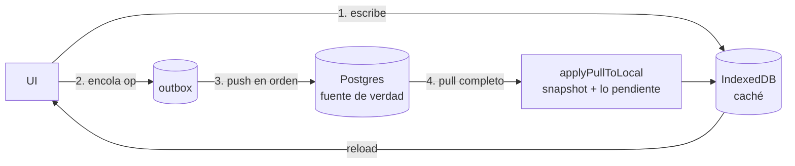

# Dominio: modelo de sincronización

El modelo conceptual y sus **invariantes**, independiente del código. Lee esto antes de tocar [[sync]] o
[[postgres-schema]]: casi todo lo raro de esos ficheros es consecuencia directa de alguna regla de aquí.

## El modelo en una frase

**IndexedDB es caché + cola; Supabase es la fuente de verdad.** Se escribe siempre primero en local
(así la app funciona sin conexión) y lo escrito se sube cuando hay red. Cuando dos dispositivos tocan
lo mismo, **gana el sello más reciente** (*last-write-wins*).

## Los nueve invariantes

### 1. Local primero, siempre

Ninguna escritura del usuario depende de la red. La única excepción es **"Borrar todo"**, y es
deliberada. → [[borrado-total]]

### 2. El orden de la cola es el orden causal

El `seq` del outbox es una clave autoincremental: el orden de las claves **es** el orden en que se
hicieron las escrituras, y el push lo respeta. Importa porque las FK de Postgres exigen que la
categoría llegue antes que su subcategoría, y esta antes que el movimiento que la usa.
→ [[003-outbox-en-indexeddb]]

### 3. Todo es idempotente

Las ops son `upsert` por id o `delete` por id, y los IDs los genera el **cliente**, así que repetir una
op no duplica nada. Una op solo sale de la cola tras la confirmación del servidor: si la app muere a
mitad se reintenta. El LWW descarta el empate (`<=`), y eso es justo lo que hace inocuo el reintento.

### 4. El sello nunca retrocede en un dispositivo

Cada escritura recibe un `updatedAt` **al menos 1 ms mayor** que el último emitido en ese dispositivo,
persistido en `meta.lastStampAt`. Sin esto, un reloj que se atrase (cambio de hora, NTP) dejaría de
poder escribir: el trigger LWW descartaría todo en silencio. → `monotonicStamp` en [[sync]]

### 5. Los timestamps son texto ISO comparable byte a byte

`text collate "C"` en Postgres, `toISOString()` en el cliente. Comparar strings **es** comparar fechas,
en los dos lados, sin conversiones. → [[002-lww-con-updated-at-text]]

### 6. Un borrado no resucita

Al borrar un movimiento, el servidor guarda una **lápida** con `deleted_at`. Un upsert que llegue tarde
desde un dispositivo offline se compara contra ella y se descarta. **Ante empate gana el borrado**:
borrar es explícito y destructivo; resucitar por accidente es peor que perder una edición del mismo
milisegundo.

### 7. Un "Borrar todo" no se repuebla

El wipe **purga también las lápidas**, así que el invariante 6 no cubre ese caso. La defensa es el
`wipe_epoch`: un dispositivo con epoch antiguo **tira su cola** antes de pushear. Por eso
`adoptWipeEpoch` se comprueba **antes** del push. → [[borrado-total]]

### 8. Lo pendiente gana en pantalla

Al aplicar un snapshot del servidor se reproducen encima las ops que aún no se han subido
(`applyPullToLocal`). Si no, un pull inmediatamente posterior a una escritura borraría de la pantalla
algo que el usuario acaba de escribir. En el servidor decidirá el LWW; **en local manda lo pendiente**.

Corolario: **solo se hace pull con la cola vacía**.

### 9. En modo demo no se encola

La demo no es "un dispositivo offline": es un dispositivo **sin servidor**. La diferencia importa porque
el modelo offline se apoya en que la cola se sube más tarde, y aquí no hay más tarde. Por eso `enqueue()`
sale antes de escribir en el `outbox` en vez de dejarlo crecer: una cola que nunca se drena no es una
cola pendiente, es basura que además mentiría en el indicador.

Corolario: el `outbox` de la base demo está **siempre vacío**, y es la comprobación de un vistazo de que
el aislamiento funciona. → [[010-modo-demo]]

## Granularidad del conflicto

La unidad de conflicto es **la fila**, no el documento:

| Entidad | Unidad de LWW |
|---|---|
| Movimiento | el movimiento |
| Categoría | la categoría (nombre, tipo, orden, archivado) |
| Subcategoría | **cada subcategoría por separado** |

De ahí que las subcategorías estén normalizadas en el servidor aunque en el cliente vayan embebidas:
permite que "renombro la subcategoría A en el móvil" y "renombro la B en el portátil" **sobrevivan las
dos**. → [[007-subcategorias-normalizadas-en-servidor]]

## Reparto de responsabilidades

| Responsabilidad | Dónde |
|---|---|
| Sellar las escrituras (monótono) | Cliente (`nextStamp`) |
| Decidir qué filas cambiaron | Cliente (`diffCategoryDoc`) |
| Descartar escrituras viejas | **Servidor** (trigger `discard_stale_write`) |
| Impedir resurrecciones | **Servidor** (trigger + lápidas) |
| Reparar referencias colgantes | Cliente (`repairDanglingRefs`), antes de chocar con la FK |
| Mezclar snapshot + pendientes | Cliente (`applyPullToLocal`) |
| Aislar los datos por usuario | **Servidor** (RLS + PK `(user_id, id)`) |
| Aislar la demo de tus datos | Cliente (base de IndexedDB aparte + los guards de `isDemo()`) |

Regla práctica: **la coherencia la garantiza el servidor; el cliente solo intenta no darle basura.**

## Lo que este modelo NO resuelve

- **No hay merge de campos**: si dos dispositivos editan el mismo movimiento, el que gana se lleva la
  fila entera. Aceptable con un solo usuario y volumen bajo de escritura.
- **No hay pull incremental**: cada pull se trae las tres tablas completas. Con cientos de movimientos
  es irrelevante; con decenas de miles habría que añadir `movements (user_id, updated_at)` y filtrar por
  `updated_at`. → [[postgres-schema]]
- **No hay tiempo real**: la latencia es el sondeo de 60 s o el `visibilitychange`. → [[004-sin-realtime]]

Related: [[sync]] · [[first-sync]] · [[pull]] · [[escritura-local]] · [[borrado-total]] · [[postgres-schema]] · [[010-modo-demo]]
