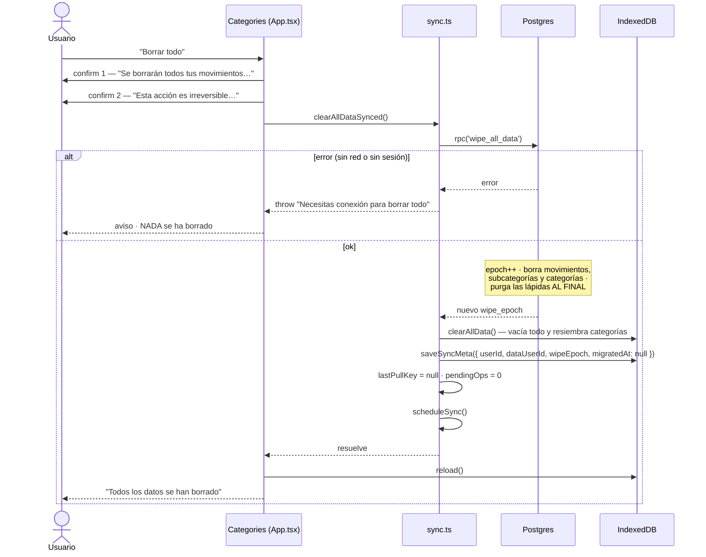
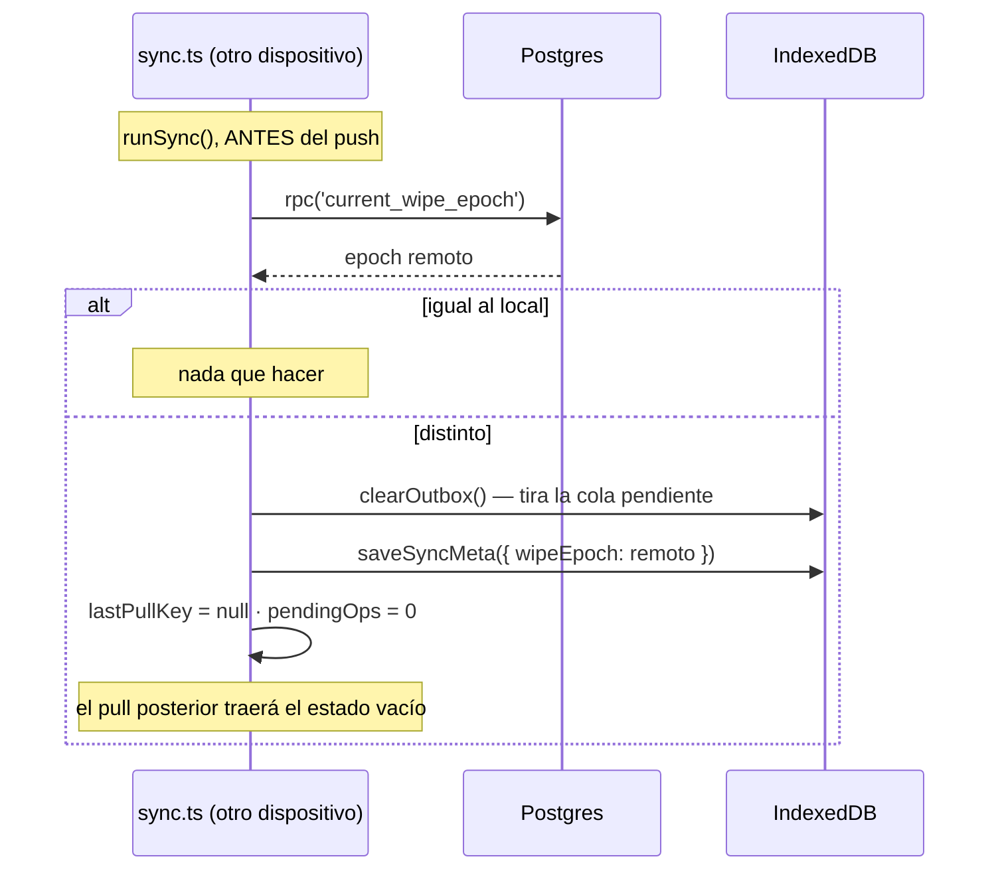

# Flujo: borrar todos los datos

"Borrar todo" (zona de peligro de la pantalla Categorías). **La única operación de la app que exige
conexión.**

**Fuente de verdad**: `clearAllDataSynced` / `adoptWipeEpoch` en `src/sync.ts` · `wipe_all_data()` en el esquema

## Por qué exige conexión

Un borrado que se encolara podría cruzarse con un dispositivo que aún tiene cambios pendientes y
**repoblaría lo que se acaba de vaciar**. Haciéndolo primero en el servidor se incrementa el
`wipe_epoch`, que es lo que hace que los demás dispositivos tiren su cola en vez de resucitar los datos.

## El flujo

## Detalles del lado cliente

- **`clearAllData()` vacía también `outbox` y `meta`.** Dejar ops encoladas repoblaría el servidor recién
  vaciado. `meta` es bookkeeping reconstruible: el epoch se relee y la vinculación es idempotente.
- **`migratedAt` vuelve a `null` a propósito**: el borrado resiembra las categorías por defecto en local
  y el servidor se ha quedado sin ninguna, así que hay que **volver a subirlas** o el próximo movimiento
  no tendría categoría a la que apuntar. De ahí el `scheduleSync()` final: cuanto antes se rehaga la
  vinculación, mejor. → [[first-sync]]
- **`userId`/`dataUserId` se reescriben** justo después, porque `clearAllData` vacía `meta` y ahí vive el
  `userId` del que depende el arranque sin conexión. → [[login]]
- `lastPullKey = null` fuerza a que el próximo pull se aplique aunque el servidor devuelva "vacío".

## Detalles del lado servidor (`wipe_all_data()`)

`SECURITY DEFINER`, porque toca dos tablas sobre las que `authenticated` no tiene grants suficientes:
`sync_meta` (solo `SELECT`) y `movement_tombstones` (nada).

- **No recibe parámetros.** Una versión `wipe_all_data(p_user_id uuid)` sería un **IDOR de manual**: como
  definer, saltaría la RLS.
- Si `auth.uid()` es `NULL` lanza `42501` explícito: sin eso, `where user_id = null` no borraría nada y
  el insert en `sync_meta` petaría con un `23502` opaco.
- **El epoch se incrementa primero**: si algo falla después, toda la transacción se deshace y no queda un
  epoch incrementado sobre datos intactos.
- **Las lápidas se purgan SIEMPRE al final**: el `DELETE` de movimientos acaba de disparar el trigger
  `AFTER DELETE` y ha creado una lápida por movimiento. Purgarlas antes las dejaría recién resucitadas.
- Devuelve el nuevo `wipe_epoch`.

→ [[postgres-schema]]

## Cómo lo detectan los demás dispositivos (`adoptWipeEpoch`)

**El epoch es la única defensa aquí**: un wipe purga las lápidas, así que el trigger anti-resurrección
no cubre este caso. Por eso se comprueba **antes** de pushear. → [[sync-model]]

El RPC de lectura es `current_wipe_epoch()`, y existe para que el cliente no tenga que distinguir "no
hay fila en `sync_meta`" de "epoch 0" (con `.single()` eso sería un `PGRST116` que parece un error).

## Consecuencia asumida

Un dispositivo que estuviera offline con cambios sin subir **los pierde** si otro hace "Borrar todo".
Es la decisión correcta: el usuario acaba de pedir explícitamente que no quede nada.

Related: [[sync-model]] · [[first-sync]] · [[postgres-schema]] · [[qa-playbook]]
