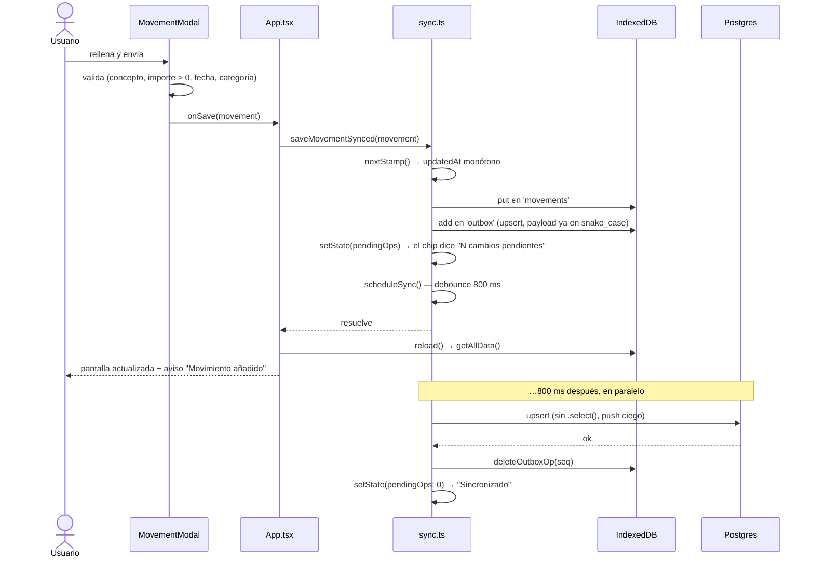

# Flujo: escritura local → subida

Qué pasa exactamente al guardar, editar o borrar. **La red no aparece en el camino del usuario**: se
escribe en IndexedDB, se encola y la subida ocurre después, por su cuenta.

**Fuente de verdad**: `saveMovementSynced` / `removeMovementSynced` / `saveCategorySynced` / `enqueue` en `src/sync.ts`



## Puntos clave

- **El sello se pone aquí, no en el modal.** `MovementModal` ya calcula un `updatedAt`, pero
  `saveMovementSynced` lo **re-sella**: así solo hay un sitio que decide los sellos y todos son
  monótonos. → [[sync-model]]
- **El payload se guarda ya como fila del servidor** (snake_case). [[db]] no necesita conocer ese
  formato; lo estrecha `sync.ts`.
- **El debounce de 800 ms** (`scheduleSync`) agrupa varias escrituras seguidas en un solo ciclo. La
  pantalla no espera: `reload()` ya ha pintado el cambio.
- **La op solo sale de la cola tras la confirmación del servidor.** Si la app muere a mitad, se
  reintenta; todas las ops son idempotentes.

## Variantes

### Borrar un movimiento

Igual, pero encola `{ kind: 'delete', id }` y **sin payload**. El servidor deja una **lápida** al
borrar, y con ella descarta un upsert tardío de otro dispositivo: un borrado nunca resucita.
→ [[sync-model]]

### Guardar una categoría

`saveCategorySynced` no encola el documento entero: pasa por **`diffCategoryDoc`**, que compara contra
lo guardado y devuelve `{ doc, ops }`.

```mermaid
sequenceDiagram
    participant A as Categories (App.tsx)
    participant S as sync.ts
    participant DB as IndexedDB

    A->>S: saveCategorySynced(categoría entera)
    S->>DB: getCategory(id) → versión anterior
    S->>S: nextStamp()
    S->>S: diffCategoryDoc(prev, next, stamp)
    Note over S: solo las filas que cambiaron;<br/>la categoría va DELANTE de sus subcategorías (FK);<br/>las filas intactas conservan su sello
    S->>DB: saveCategory(doc) — el MISMO updatedAt que se sube
    S->>DB: enqueueOutbox(ops)
```

Que `doc` y las ops compartan sello **no es un detalle**: si se sellara una cosa en local y otra
arriba, el LWW compararía contra un valor que no tiene nadie.

### Si no hay red

Nada cambia en este flujo: la op se queda en el outbox, el chip dice "Sin conexión" y el aside
"N cambios pendientes. Se subirán al volver la red." El evento `online` dispara `syncNow()`.
→ [[pull]]

### Si el servidor rechaza la op

- Error de **red/5xx/401** → se reintenta y la op **sigue en la cola** (estado `error`).
- Violación de **integridad (23xxx)** o de **dato (22xxx)** → irrecuperable: se descarta la op, se
  registra en consola y `lastError` se le cuenta al usuario ("Un cambio no se pudo sincronizar…").
  Reintentarla atascaría la cola para siempre. → [[sync]]

Related: [[sync]] · [[sync-model]] · [[pull]] · [[db]] · [[movimientos]]
