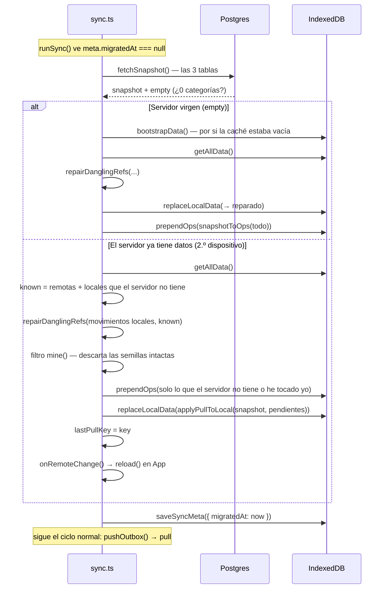

# Flujo: vinculación de un dispositivo (first sync)

La primera sincronización de un navegador. **Es el flujo más delicado del proyecto**: aquí es donde se
duplicarían categorías o se perderían movimientos si algo se hace en el orden equivocado.

Se dispara cuando `meta.migratedAt` es `null`, y ocurre **antes del push** del ciclo normal.

**Fuente de verdad**: `firstSync` / `uploadEverything` / `mergeWithServer` / `prependOps` / `snapshotToOps` en `src/sync.ts`

## Las cinco decisiones que sostienen el flujo

### 1. Siempre pull antes que push

Subir a ciegas sobre un servidor que ya tiene datos **duplicaría el árbol de categorías** del otro
dispositivo. Por eso lo primero es `fetchSnapshot()`.

### 2. Es idempotente

Los IDs del cliente son la **clave primaria** en Postgres: repetir la vinculación es un upsert, no una
duplicación. Si el proceso se corta a mitad, volver a intentarlo es seguro.

### 3. La subida va por el outbox, no en bloque

Si se corta la conexión a mitad, **lo ya confirmado no se repite** y el resto se reintenta solo. Una
subida en bloque sería más rápida pero habría que rehacerla entera — y esto ocurre **una única vez por
dispositivo**.

### 4. `prependOps`: las ops de vinculación van DELANTE de la cola previa

El caso real que esto resuelve: **creas un movimiento antes de que el dispositivo se vincule**. Si sus
categorías se encolaran detrás, el movimiento llegaría primero, la FK lo rechazaría con un `23503` y el
push —que trata las violaciones de integridad como irrecuperables— **lo descartaría**.

Como el outbox es autoincremental, adelantar ops obliga a **reescribir la cola entera** (leer, vaciar,
reencolar). Lo anterior se conserva en vez de darlo por incluido en el snapshot: **un borrado pendiente
no deja rastro en la caché** y se perdería.

Dentro del snapshot, las **categorías van antes que los movimientos**, por lo mismo.

### 5. `mine()`: distinguir "semilla intacta" de "esto lo he tocado yo"

En el segundo dispositivo manda lo remoto, pero **sin tirar lo que solo existe aquí**. El filtro:

- **Movimientos** → se sube el que el servidor no tenga (son uuid, no chocan).
- **Categorías y subcategorías** → se sube la que el servidor no tenga **o** la que tenga un
  `updatedAt` distinto de `EPOCH_UPDATED_AT`. Ese sello de época significa "semilla que nunca he
  tocado": subirla sería ruido, y además el LWW la descartaría.

→ [[categorias]]

## Después: el estado local

- `meta.migratedAt` queda con la fecha: el flujo no se repite.
- `meta.dataUserId` ya se fijó en `adoptUser`, antes de todo esto. → [[login]]
- Si se cambia de usuario en el mismo navegador, `adoptUser` pone `migratedAt` de nuevo a `null` y la
  vinculación **se rehace** para el usuario nuevo.
- `clearAllDataSynced` también lo pone a `null`: el borrado resiembra las categorías por defecto en
  local y el servidor se ha quedado sin ninguna, así que hay que volver a subirlas o el próximo
  movimiento no tendría categoría a la que apuntar. → [[borrado-total]]

## Cómo probarlo

`sync.test.ts` **sí** cubre este flujo, con el cliente de Supabase mockeado (bloque
`describe('primera vinculación')`): servidor vacío, reparación de huérfanos, semillas intactas que no se
reenvían, una categoría tocada que sí se reenvía, la cola previa que se pushea detrás de sus categorías,
y que no se repite en el sync siguiente. Lo que **no** cubre es el diálogo real con Postgres: las FK, la
RLS y los triggers solo se ejercen contra un proyecto de verdad → [[qa-playbook]], caso 4.

Related: [[sync]] · [[sync-model]] · [[pull]] · [[categorias]] · [[login]] · [[qa-playbook]]
