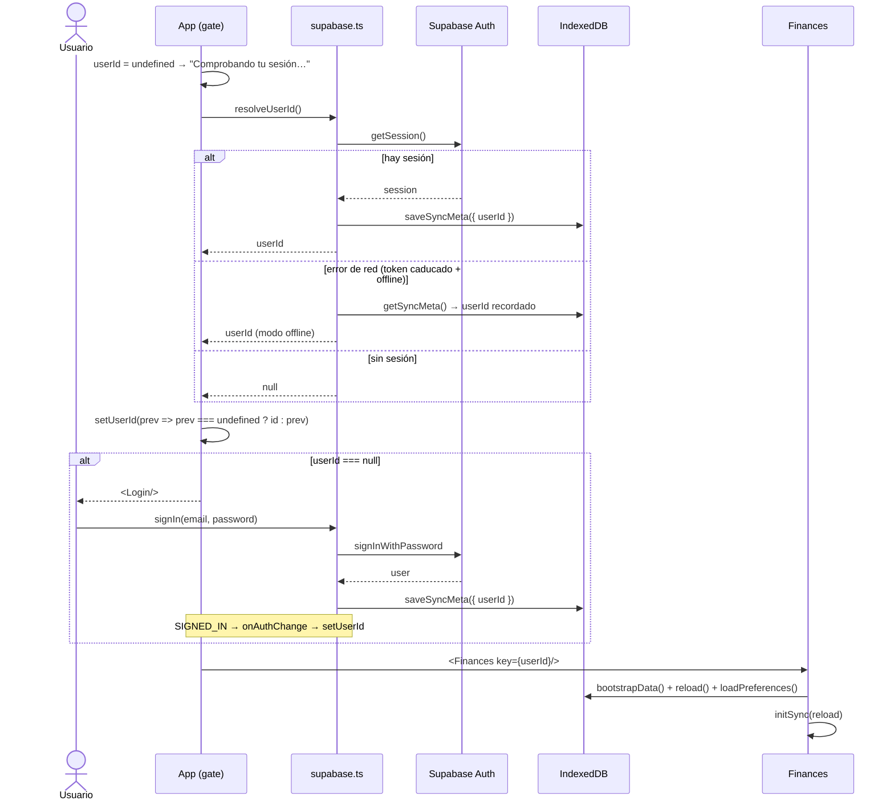
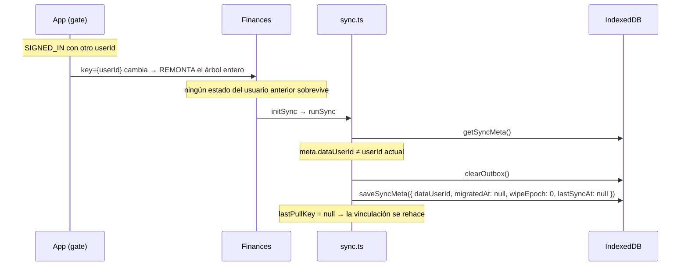

# Flujo: arranque, sesión y cambio de usuario

Sin sesión **no se puede usar la app**. Este flujo cubre el arranque, el caso offline y el cambio de
cuenta en el mismo navegador.

**Fuente de verdad**: `App` en `src/App.tsx` · `src/supabase.ts` · `adoptUser` en `src/sync.ts`

## Arranque

## Las cuatro sutilezas

### 1. `prev === undefined` resuelve una carrera real

Si el usuario entra **mientras `resolveUserId` sigue en vuelo**, `SIGNED_IN` ya habría fijado el id y la
resolución inicial (`null`) lo pisaría devolviéndolo al login. **La suscripción manda**; `resolveUserId`
solo rellena el hueco inicial.

### 2. `INITIAL_SESSION` se ignora

Llega con `session: null` en el caso offline y **después** de que `resolveUserId` haya resuelto: atenderlo
echaría al usuario al login teniendo datos locales perfectamente usables. La suscripción solo atiende
transiciones.

### 3. El fallback offline vive en `meta.userId`

El access token dura **1 hora**. Sin conexión y con el token caducado, `getSession()` devuelve
`session: null` aunque la sesión siga guardada. Sin el fallback, abrir la app offline una hora después
del último refresco te dejaría fuera de tus propios datos.

Por eso `signOut()` limpia `meta.userId` **antes** de cerrar sesión: es la llave de ese modo.

### 4. El gate está en su propio componente

Los hooks de `Finances` no pueden ser condicionales, y además así **sin sesión no se siembran las
categorías por defecto** (`bootstrapData`) antes de saber qué hay en el servidor. → [[first-sync]]

## Cambio de usuario en el mismo navegador

Dos mecanismos, uno en la UI y otro en los datos:

**`dataUserId` no es `userId`.** `resolveUserId()` sobrescribe `userId` con el usuario actual en cada
arranque; `dataUserId` dice **de quién son los datos cacheados**. Sin ese campo aparte, un cambio de
usuario sería indetectable y mezclaría los dos históricos.

Nótese el matiz de `adoptUser`: si `dataUserId` era `null` (primer arranque) **no** se resetea
`migratedAt` — no hay nada que invalidar.

## Cerrar sesión

- `scope: 'local'`: no llama al servidor, así que funciona sin conexión. Con un único usuario no hay
  otras sesiones que revocar.
- **No vacía el outbox**: al volver a entrar con la misma cuenta se sube igual. Lo que sí lo tira es
  entrar con **otra** cuenta, y eso el usuario no puede deducirlo — de ahí el `confirm` que avisa de los
  cambios sin sincronizar antes de salir.

Related: [[supabase-auth]] · [[ui-app]] · [[first-sync]] · [[006-un-solo-usuario]]
