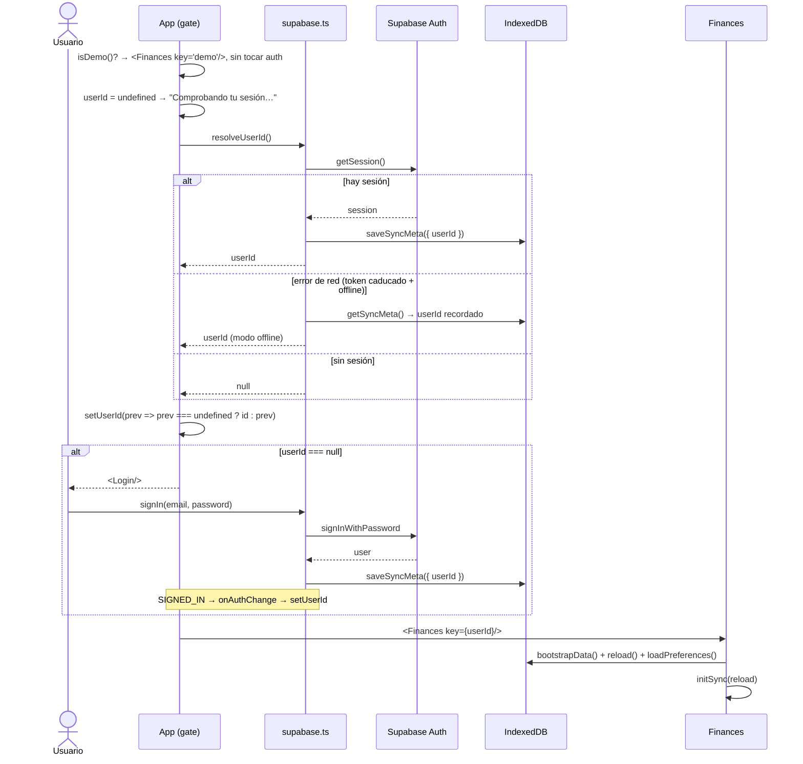
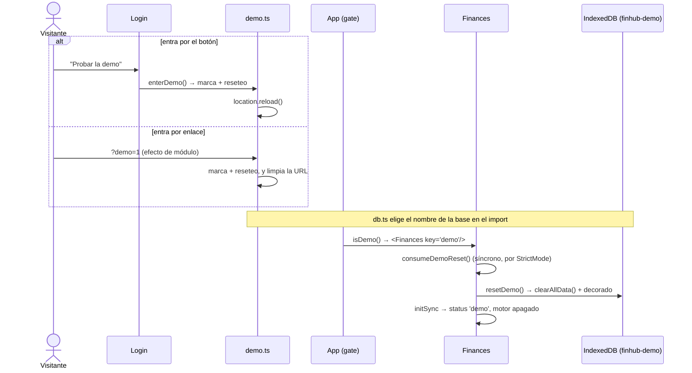
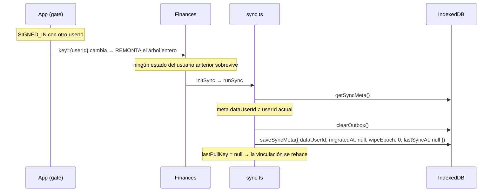

# Flujo: arranque, sesión y cambio de usuario

Sin sesión no se pueden usar **tus** datos: la única entrada sin cuenta es el modo demo, que corre
aislado y no habla con el servidor. Este flujo cubre el arranque, el caso offline, el cambio de cuenta en
el mismo navegador y la tercera rama del gate.

**Fuente de verdad**: `App` en `src/App.tsx` · `src/supabase.ts` · `src/demo.ts` · `adoptUser` en `src/sync.ts`

## Arranque

## El tercer camino: modo demo

El gate tiene **tres** ramas, y la de la demo va primero: `if (isDemo()) return <Finances key="demo"/>`.
En ese modo no se llama a `resolveUserId()` ni se suscribe a `onAuthChange` (el guard vive **dentro** del
efecto, porque los hooks no pueden ser condicionales), así que `supabase.auth` no se toca en ningún momento.

Dos claves de `localStorage` y no una: la **marca** (`finhub-demo`) dura mientras estés en la demo; el
**reseteo** (`finhub-demo-reset`) se consume en el primer arranque. Por eso cada entrada empieza limpia y
una recarga dentro de la demo no pierde lo que hayas probado. Salir borra la base demo y quita la marca.

Los cuatro guards que impiden que la demo hable con el servidor están en [[sync]]; el porqué del diseño,
en [[010-modo-demo]].

## Las cuatro sutilezas

### 1. `prev === undefined` resuelve una carrera real

Si el usuario entra **mientras `resolveUserId` sigue en vuelo**, `SIGNED_IN` ya habría fijado el id y la
resolución inicial (`null`) lo pisaría devolviéndolo al login. **La suscripción manda**; `resolveUserId`
solo rellena el hueco inicial.

### 2. `INITIAL_SESSION` se ignora

Llega con `session: null` en el caso offline y **después** de que `resolveUserId` haya resuelto: atenderlo
echaría al usuario al login teniendo datos locales perfectamente usables. La suscripción solo atiende
transiciones.

### 3. El fallback offline vive en `meta.userId`

El access token dura **1 hora**. Sin conexión y con el token caducado, `getSession()` devuelve
`session: null` aunque la sesión siga guardada. Sin el fallback, abrir la app offline una hora después
del último refresco te dejaría fuera de tus propios datos.

Por eso `signOut()` limpia `meta.userId` **antes** de cerrar sesión: es la llave de ese modo.

### 4. El gate está en su propio componente

Los hooks de `Finances` no pueden ser condicionales, y además así **sin sesión no se siembran las
categorías por defecto** (`bootstrapData`) antes de saber qué hay en el servidor. → [[first-sync]]

## Cambio de usuario en el mismo navegador

Dos mecanismos, uno en la UI y otro en los datos:

**`dataUserId` no es `userId`.** `resolveUserId()` sobrescribe `userId` con el usuario actual en cada
arranque; `dataUserId` dice **de quién son los datos cacheados**. Sin ese campo aparte, un cambio de
usuario sería indetectable y mezclaría los dos históricos.

Nótese el matiz de `adoptUser`: si `dataUserId` era `null` (primer arranque) **no** se resetea
`migratedAt` — no hay nada que invalidar.

## Cerrar sesión

- `scope: 'local'`: no llama al servidor, así que funciona sin conexión. Con un único usuario no hay
  otras sesiones que revocar.
- **No vacía el outbox**: al volver a entrar con la misma cuenta se sube igual. Lo que sí lo tira es
  entrar con **otra** cuenta, y eso el usuario no puede deducirlo — de ahí el `ConfirmDialog` que avisa
  de los cambios sin sincronizar antes de salir. **Solo salta si hay cola**: sin nada pendiente se
  cierra sesión sin preguntar, porque no hay nada que explicar.
- El botón vive en el aside **y** en la hoja que abre el chip de la cabecera (`SessionSheet`), que es la
  única vía por debajo de 760 px porque ahí el aside no existe. Es el mismo `SyncNote` renderizado en dos
  sitios, no dos botones. → [[ui-app]]
- **Quién pregunta es `App.tsx`, no `SyncNote`.** El botón solo llama a `onSignOut`; el diálogo se monta
  una sola vez arriba y `signOff` cierra antes la `SessionSheet`, porque dos modales anidados se
  pisarían el `Escape` y el bloqueo de scroll. → [[ui-app]]

En demo, ese botón pasa a ser **"Salir de la demo"** y su diálogo avisa de lo contrario: no hay nada
pendiente de subir (nunca se encola), pero salir **sí borra** los datos de prueba — así que ahí pregunta
siempre.

Related: [[supabase-auth]] · [[ui-app]] · [[first-sync]] · [[006-un-solo-usuario]] · [[010-modo-demo]]
