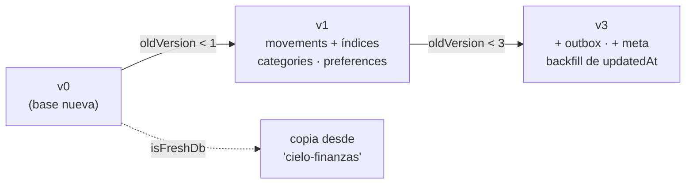
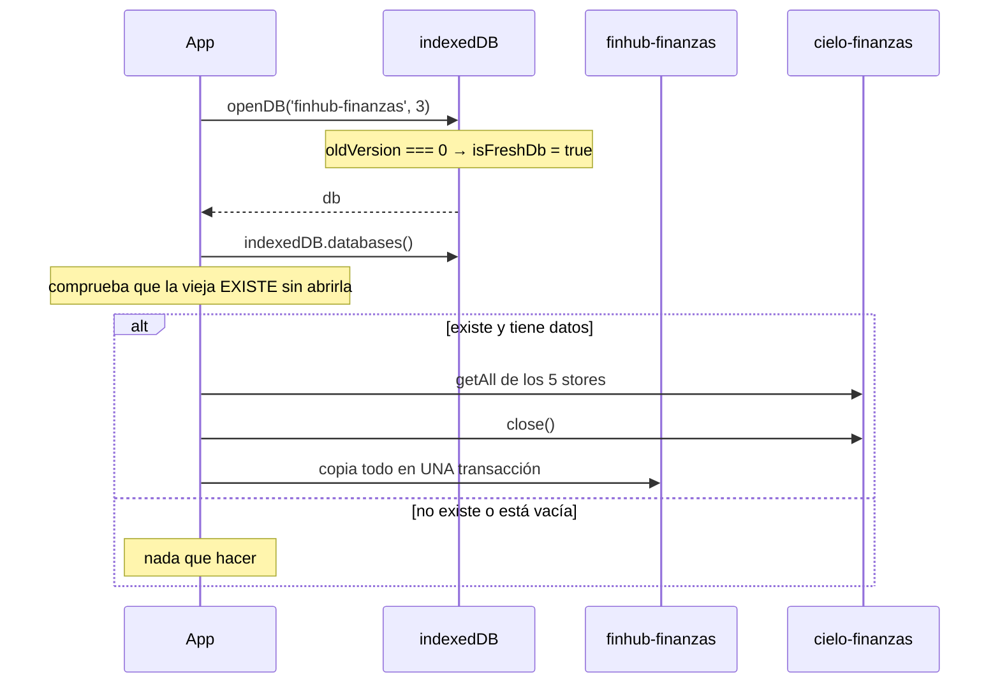

# Flujo: migraciones de IndexedDB

La base local es `finhub-finanzas`, **versión 3**. Esta nota explica cómo se llegó ahí y, sobre todo,
**la regla para la próxima migración**.

**Fuente de verdad**: `dbPromise` y `migrateFromLegacyDb` en `src/db.ts` · tests `src/db.migration.test.ts` y `src/db.rename-migration.test.ts`

## ⚠️ La regla para cualquier cambio de esquema

Un cambio de esquema exige **subir la versión** *y* **añadir su propio bloque guardado por
`oldVersion`**, sin tocar los anteriores:

```ts
if (oldVersion < 4) { /* solo lo nuevo de la v4 */ }
```

Los bloques anteriores se quedan como están: un navegador que venga de la v1 los ejecuta en cadena.
Modificar un bloque antiguo rompe a quien todavía no haya migrado.

**Y antes de subir la versión, comprueba si de verdad hace falta**: añadir un campo a `SyncMeta` **no**
la necesita, porque `getSyncMeta()` mergea con los defaults y un registro viejo se completa al leerlo.
→ [[db]]

## Historia de versiones



- **v1** — `movements` (con índices `date` y `type`), `categories`, `preferences`.
- **v2** — existió como número de versión, pero **sin bloque `upgrade` propio**: no cambió nada.
- **v3** — añade los stores `outbox` y `meta` (los dos out-of-line) y **rellena `updatedAt`** en las
  categorías y subcategorías que ya existieran, con `EPOCH_UPDATED_AT`. Sin ese backfill, una categoría
  sin sello no podría entrar en el LWW. → [[categorias]]

### El detalle que rompe transacciones

En el backfill de la v3 los `put` se emiten **sin `await`**, todos en el mismo microtask en que resuelve
el `getAll`:

```ts
const rows = await categories.getAll();
for (const category of rows) categories.put({ ... });   // sin await
```

Encadenar un `await` por cada `put` **cierra la transacción `versionchange` antes de tiempo** (IndexedDB
la autocommitea cuando la cola de peticiones se vacía). `openDB` ya espera a `tx.done`.

Por lo mismo, **los `createObjectStore` van primero y síncronos**, antes de cualquier `await`.

## La copia desde la marca anterior (Cielo → FinHub)

IndexedDB **no tiene "rename"**: un nombre nuevo es una base vacía. Con el rebranding, quien ya tuviera
movimientos guardados en `cielo-finanzas` se habría quedado sin ellos.



- **Solo se intenta si `oldVersion === 0`** (`isFreshDb`): es la única situación en la que tiene sentido
  buscar datos bajo el nombre antiguo.
- **`indexedDB.databases()` es imprescindible** para comprobar que la base antigua existe **sin abrirla**:
  abrirla por nombre con `openDB` la **crearía vacía** si no existiera, y con eso perderíamos la
  comprobación. Se comprueba que la función exista (no todos los navegadores la traen).
- Se copian los cinco stores, incluido el `outbox` **con sus claves originales** (para no alterar el orden
  causal) y el registro de `meta`.
- Si la base antigua está vacía, no se copia nada.

Esta copia es de un solo uso: en cuanto `finhub-finanzas` existe, `isFreshDb` es `false` para siempre.
El código puede retirarse cuando se dé por seguro que ningún navegador conserva la base antigua.

## Tests

- `db.migration.test.ts` — crea una base v2 a mano, abre la v3 y comprueba que se crean `outbox`/`meta`,
  que se rellena `updatedAt` y que **los movimientos no se tocan**.
- `db.rename-migration.test.ts` — siembra `cielo-finanzas` y comprueba que los datos aparecen en
  `finhub-finanzas`.

Los dos dependen de `fake-indexeddb/auto` (cargado en `src/test/setup.ts`). → [[testing]]

Related: [[db]] · [[indexeddb-stores]] · [[categorias]] · [[testing]]
