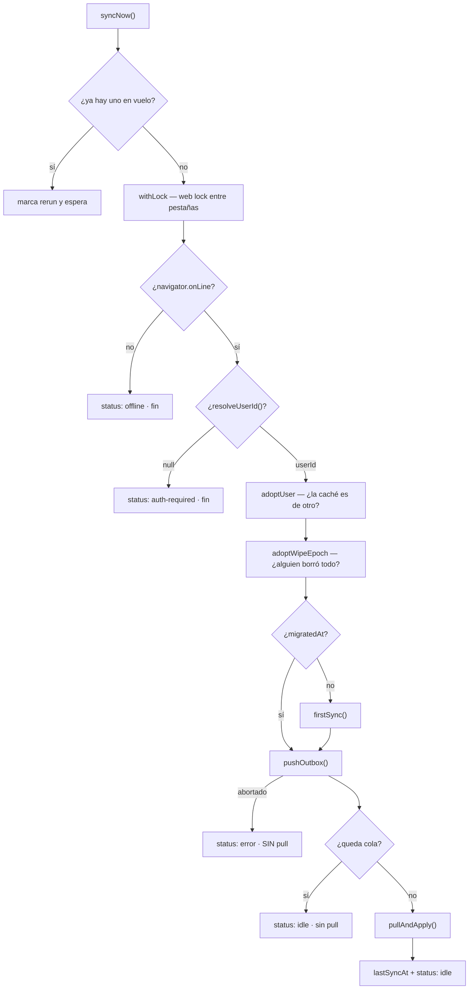
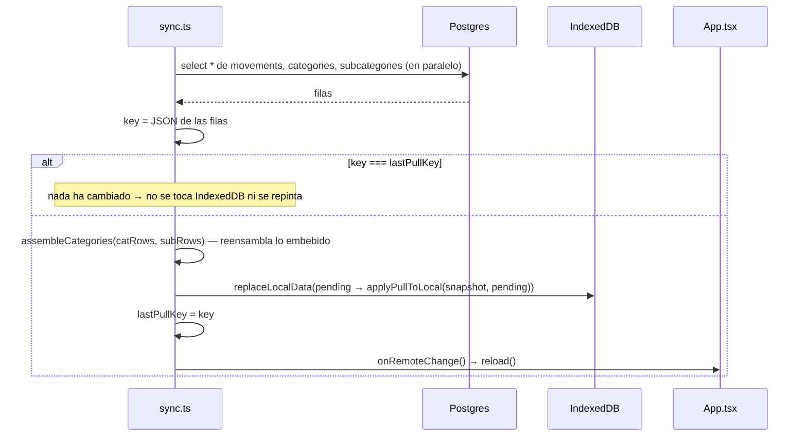

# Flujo: pull y ciclo de sincronización

Cómo baja el estado del servidor a la pantalla, y cuándo.

**Fuente de verdad**: `runSync` / `pullAndApply` / `fetchSnapshot` / `initSync` en `src/sync.ts`

## El ciclo completo (`runSync`)

**El orden no es negociable**, y cada paso está donde está por un motivo:

- **`adoptWipeEpoch` antes del push** — si otro dispositivo hizo "Borrar todo", pushear la cola
  repoblaría lo que se acaba de vaciar. → [[borrado-total]]
- **`firstSync` antes del push** — hasta que el dispositivo no se ha vinculado, su cola no basta para
  dejar el servidor coherente: las categorías por defecto se siembran en local y **nunca pasan por la
  cola**, así que un movimiento suyo se estrellaría contra la FK. → [[first-sync]]
- **Pull solo con la cola vacía** — aplicar el snapshot con escrituras sin subir dejaría la pantalla
  mostrando la versión vieja de algo que el usuario acaba de escribir. → [[sync-model]]

## `pullAndApply`

Cuatro detalles:

- **`lastPullKey`** evita que el sondeo de cada minuto repinte los gráficos y remonte la tabla sin que
  nada haya cambiado.
- **El pull es completo**, no incremental: se traen las tres tablas enteras. Con este volumen es lo más
  simple y correcto; el coste de un pull incremental sería un índice y un estado más. → [[sync-model]]
- **`assembleCategories`** traduce las tablas normalizadas a la forma embebida que espera el resto de la
  app. Las subcategorías sin categoría padre se caen solas (no deberían existir: hay FK con
  `ON DELETE CASCADE`, pero reensamblar es el sitio barato de no fiarse).
- **`applyPullToLocal`** reproduce encima las ops pendientes, así una escritura reciente sobrevive a la
  sustitución de la caché.

## Los cinco disparadores (`initSync`)

| Disparador | Cuándo | Por qué |
|---|---|---|
| Arranque | Al montar `Finances` | Traer lo que haya pasado desde la última vez |
| `online` | Vuelve la red | Subir la cola cuanto antes |
| `visibilitychange` | Se vuelve a la pestaña | **El momento que de verdad importa**: "abro el móvil y veo lo del portátil" |
| Sondeo cada **60 s** | Solo si la pestaña está **visible** | En segundo plano gastaría batería para nada |
| Debounce de **800 ms** | Tras cada escritura | Agrupa varias escrituras en un ciclo |

`initSync` devuelve la función de parada, que quita los listeners y limpia el intervalo. También hay un
listener de `offline` que solo fija el estado.

**Sin Realtime a propósito** → [[004-sin-realtime]].

## Exclusión mutua: dos capas

1. **De módulo** (`inFlight` + `rerun`) — evita que los cinco disparadores se pisen entre sí. Las
   llamadas concurrentes se funden en una ejecución más un repaso.
2. **Web lock** (`navigator.locks`, nombre `finhub-sync`) — evita lo mismo **entre pestañas** del mismo
   navegador, que comparten IndexedDB pero no variables de módulo. jsdom no trae `navigator.locks`, de
   ahí la comprobación en vez de darlo por hecho.

## Estado que ve el usuario al arrancar

`initSync` hace dos lecturas antes del primer ciclo:

- `readOutbox()` → `pendingOps`, para que el chip diga la verdad desde el primer render.
- `getSyncMeta()` → `lastSyncAt`, porque el estado en memoria arranca a `null`: sin esto, al recargar la
  página la UI diría "todo al día" sin fecha hasta terminar el primer sync (y sin red, nunca).

Related: [[sync]] · [[sync-model]] · [[first-sync]] · [[escritura-local]] · [[borrado-total]]
