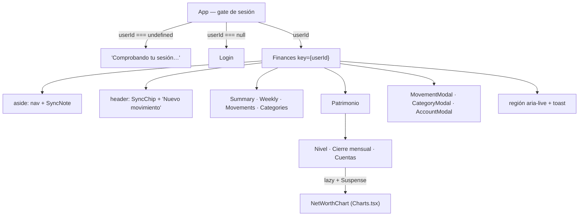

# Módulo: App (la UI entera)

`src/App.tsx` contiene el shell y casi todas las pantallas: `Summary`, `Weekly`, `Movements`,
`MovementModal`, `CategoryModal` y `Categories`. Viven aparte los gráficos ([[charts]]), el login
([[supabase-auth]]), el indicador de sync y la pantalla de patrimonio (`src/Patrimonio.tsx`, que es la
única página con fichero propio: tiene tres subvistas y un CRUD dentro).

`src/Ui.tsx` son las dos piezas de presentación compartidas, `Stat` y `Empty`. Salieron de `App.tsx`
cuando `Patrimonio.tsx` las necesitó: importarlas desde `./App` sería un ciclo, y duplicarlas partiría en
dos el contrato de markup que espera la CSS.

**Fuente de verdad**: `src/App.tsx` · `src/Patrimonio.tsx` · `src/Ui.tsx` · `src/SyncStatus.tsx` ·
`src/syncCopy.ts`

## Estructura



## El gate de sesión

Vive en su propio componente porque **los hooks de `Finances` no pueden ser condicionales**: sin sesión
ni siquiera se monta, así que tampoco se siembran las categorías por defecto antes de saber qué hay en
el servidor.

```ts
resolveUserId().then(id => setUserId(prev => prev === undefined ? id : prev));
return onAuthChange(setUserId);
```

El `prev === undefined` **es la carrera real**: si el usuario entra mientras `resolveUserId` sigue en
vuelo, `SIGNED_IN` ya habría fijado el id y la resolución inicial (`null`) lo pisaría devolviéndolo al
login. **La suscripción manda**; `resolveUserId` solo rellena el hueco inicial.

`key={userId}` en `Finances`: cambiar de usuario **remonta el árbol entero**, así ningún estado
sobrevive al cambio. → [[login]]

## Estado centralizado, sin store ni context

El ciclo es **siempre** el mismo:

```
escribir (sync.ts) → await reload() → reload() re-lee TODO con getAllData() → re-render
```

Es deliberadamente tonto y correcto para este volumen de datos. **No introduzcas estado optimista ni
caché sin un motivo medido.** Los hijos reciben datos y callbacks por props.

Tres detalles del arranque:

- **`reloadRef`** — el sync necesita recargar la pantalla cuando el pull trae algo, pero `reload` es una
  función nueva en cada render: capturarla directamente congelaría la primera. El ref siempre apunta a
  la vigente.
- **`dead`** — cubre el doble montaje de StrictMode, que en desarrollo ejecutaría `initSync` dos veces
  y dejaría sueltos los listeners del primero.
- **Las preferencias se guardan solas** con un efecto que observa `prefs`, y el guard `if(!loading)`
  evita sobrescribir lo que se cargó en el arranque. → [[preferencias]]

## Estado del sync en la UI

Un **único suscriptor** con `useSyncExternalStore(subscribeSyncState, getSyncState)`; de ahí baja por
props al `SyncChip` (cabecera) y al `SyncNote` (aside). `SyncStatus.tsx` **no importa `./sync` ni
`./supabase`**: el estado entra por props, así se testea sin montar el motor ni el cliente (que revienta
al importarse sin `.env.local`) y renderizar el indicador dos veces no duplica suscripciones.

El chip está en la cabecera **además** del aside porque el aside desaparece por debajo de 760 px, que es
justo el caso en el que saber si el móvil ha sincronizado importa más.

Los avisos salen de la **propia suscripción**, no de un efecto sobre `sync`: así se ve el estado
anterior y el nuevo sin compararlos entre renders. Solo se anuncia lo que **no** se deduce de la
pantalla —quedarse sin red, un sync fallido, la sesión caducada, un error irrecuperable— y **nunca** el
ciclo `syncing → idle` del sondeo de cada minuto. Reutiliza la región `aria-live` existente en vez de
crear una segunda.

## Páginas

- **`Summary`** — `PeriodBar` + 4 `Stat` (ingresos, gastos, ahorro, tasa) + 3 gráficos en `Suspense`.
- **`Weekly`** — la tabla gasto × semana. **Ignora `prefs.periodMode` a propósito** (siempre por mes),
  así navegar aquí no cambia el modo del Resumen; lo que sí comparte es `selectedDate`. Las celdas
  vacías se pintan como guion, no como "0,00 €": en una rejilla de 8 columnas los ceros tapan los
  importes reales.
- **`Movements`** — búsqueda por concepto/nota, filtro por tipo, orden por fecha descendente. Resolver
  el nombre de la categoría cae a `'Sin categoría'`.
- **`Categories`** — renombrar, archivar/activar, reordenar, añadir subcategoría (con `prompt()`) y la
  zona de peligro con "Borrar todo". → [[categorias]] · [[borrado-total]]
- **`Patrimonio`** — cuentas, cierres mensuales, el nivel actual y su evolución, en tres subvistas. Ver
  abajo.

`pages` es la **fuente única** de `[id, icono, etiqueta, título]`: la usan el nav lateral, el nav móvil
y el `<h1>`, que antes repetían la misma lista tres veces.

En la cabecera, el botón "Nuevo movimiento" se oculta en Categorías **y en Patrimonio**: en ninguna de las
dos se registran movimientos, y el modal aparecería sobre una pantalla que no tiene nada que ver.

## `Patrimonio` (`src/Patrimonio.tsx`)

Tres subvistas con un `.segmented` propio, en estado local — **no** en las preferencias: cambiar de
subvista no es una preferencia que valga la pena persistir. Sin cuentas, Nivel y Cierre mandan a crear una
(aquí **no hay semillas**, a diferencia de las categorías) → [[patrimonio]]

- **Nivel** — dónde estás y cómo has llegado. Ver abajo.
- **Cierre mensual** — el ritual. Ver abajo.
- **Cuentas** — CRUD calcado de `Categories` (reordenar, editar, archivar/activar). Las cuentas **se
  archivan, nunca se borran**, porque los cierres históricos las referencian.

### Nivel y evolución

Cuatro `Stat` de saldo (neto, disponible, Σ activos, Σ pasivos) **en gris**, un quinto de **Δ del último
mes cerrado en verde/rojo** —el saldo es nivel, la variación es flujo → [[design-system]]—, la frase
*"ahorraste X y el mercado puso Y"*, el aviso de meses sin cerrar, la tarjeta del **sin clasificar**, el
gráfico de evolución y la lista de cuentas con su último cierre.

- **Los cuatro `Stat` de saldo y las columnas solo miran las cuentas activas; la serie las recibe todas.**
  Archivadas incluidas, o los meses viejos perderían las cuentas que entonces existían y la línea daría
  un escalón el día que archivas una. Por eso `Level` recibe la lista completa y filtra dentro.
- **El Δ del primer mes se pinta "—", no 0.** No haber podido medir no es no haber cambiado
  (`monthDelta` devuelve `null`) → [[calculations]]. Un Δ de exactamente 0 sí existe, y va en gris.
- **Badge "Mes incompleto"** cuando alguna cuenta tiene cierre en uno de los dos meses pero no en el otro:
  queda fuera del reparto y hay que decirlo. Nunca la palabra "error".
- **El gráfico va tras un `lazy()` + `Suspense` propios** (los de `Summary` viven en `App.tsx` y no se
  comparten), apuntando al mismo `Charts.tsx` → [[charts]]. Con menos de dos meses en la serie no se
  monta: no hay evolución que enseñar.
- **El quinto `Stat` ocupa la fila entera** (`.stats > .stat:nth-child(5):last-child`): con la rejilla de
  cuatro columnas se quedaba solo dejando tres huecos. La regla no toca al Resumen, que tiene cuatro.

#### El "sin clasificar"

Tarjeta propia (`.unclassified`) y **no un sexto `Stat`**: como sexta tarjeta dejaría dos huecos y le
quitaría al Δ el ancho completo de la regla de arriba, y además la cifra no va sola — lleva la explicación
y, colgando, el desglose por cuenta.

- **En gris, siempre**, aunque sea la diferencia entre dos flujos: es un aviso, no una mejora ni un
  empeoramiento → [[design-system]]
- **Se llama "sin clasificar", jamás "error"**, en el copy, en el `summary` del plegable y en cualquier
  `aria-label`. Un número que te riñe todos los meses es un módulo que abandonas en marzo, y con un
  préstamo además sería mentira → [[patrimonio]] §7
- **Se muestra, no se corrige.** No hay —ni habrá— un botón de "cuadrar": un movimiento de ajuste
  automático falsearía las categorías y contaminaría el donut, la vista semanal y las tendencias. El
  plegable lo dice explícitamente, para que el usuario no lo espere.
- **La nota va en un `<details>` nativo**, el primero del repo: el navegador ya trae el foco, el teclado y
  el anuncio hechos, y no hay estado que gestionar.
- **No bloquea nada** y desaparece con el Δ (`unclassified` devuelve `null` cuando no hay mes anterior).

#### El aviso de meses sin cerrar

`.closing-nudge` cuando `monthsWithoutClosing()` no está vacío, con el mes **anterior** al actual como
punto de partida: avisar del mes en curso daría la lata desde el día 1 → [[calculations]]

Sin `role="alert"` ni notificaciones: es un recordatorio discreto, y la región `aria-live` de `App.tsx`
sigue siendo la única viva de la app. Su botón salta a *Cierre mensual* **con el mes más antiguo pendiente
preseleccionado**, para rellenar hacia delante. Eso es lo que obligó a subir el mes del ritual de
`Closings` a `Patrimonio`.

### El ritual mensual

El requisito duro son **dos minutos**, y de ahí sale casi todo:

- **Selector de mes propio** (no `PeriodBar` ni `prefs`): un cierre es un mes `YYYY-MM`, no una fecha, así
  que navegar aquí no toca el periodo del Resumen. Hacia atrás sin límite —rellenar el histórico y
  **corregir un cierre pasado** son requisitos del dominio—; hacia delante la flecha se desactiva en el mes
  en curso. El estado vive en `Patrimonio` y no en `Closings`, porque el aviso del Nivel tiene que poder
  abrir el cierre en un mes concreto.
- **Cambiar de mes tira el borrador**, o lo tecleado para marzo se guardaría en el cierre de abril. Se
  consigue con `key={month}` sobre `Closings` —remontar es el idioma de React para "resetea el estado
  cuando cambia esta prop"—, y así da igual que el cambio venga de las flechas o del aviso del Nivel. Un
  efecto que limpiara el borrador sería además `setState` dentro de `useEffect`, que el lint prohíbe.
- **El campo va vacío, con el último saldo conocido como `placeholder` gris.** Nunca prerrellenado:
  arrastraría en silencio el número del mes pasado a la serie cada vez que te saltas una cuenta. Un campo
  vacío significa *no revisado*, y eso es información.
- **Solo se guardan las filas tocadas**, en serie (`for` + `await`, no `Promise.all`) porque el orden de
  la cola del outbox es el orden causal de las escrituras → [[sync-model]]
- **"Vaciar" solo limpia los campos**; el `saveClosingSynced` con `balance: null` se emite al guardar,
  igual que el resto. Un único camino de escritura, y reversible antes de guardar. Borrar el número a mano
  equivale a vaciar. Si la fila no tenía cierre guardado, no se emite nada.
- **El total y el contador "N de M cuentas revisadas" se calculan con lo que hay en pantalla**, no con lo
  guardado: existen para cazar un dedazo antes de guardar.
- **Dos validaciones que bloquean el guardado**, y las dos tapan pérdidas silenciosas de datos: un saldo
  negativo lo rechazaría el check de Postgres y el push descartaría la op, y un aportado sin saldo se
  iría con la fila omitida.

**El ritual no es una `<table>`**, y no por gusto: por debajo de 760 px hay una regla que reconstruye las
tablas de `.table-wrap` como tarjetas, con áreas cableadas a las seis columnas de la tabla de
Movimientos. Es una lista de filas propias (`.closing-row`), que apila sola y deja meter inputs sin
pelearse con esa rejilla.

## Modales

Los tres (`MovementModal`, `CategoryModal`, `AccountModal`) comparten el mismo patrón, y sus tres detalles
son intencionados:

- **El foco va al diálogo, no al primer input**: con `autoFocus` en el campo, el móvil abre el teclado
  nada más montar y empuja el formulario fuera de vista.
- **`body { overflow: hidden }`** mientras el modal está abierto: el teclado del móvil bloqueaba el
  scroll del fondo.
- **Dos efectos y no uno**: `onClose` cambia de identidad en cada render de `App`, así que si el foco
  viviera en el mismo efecto que el listener de `Escape` volvería al diálogo mientras se escribe.
  Rearmar solo el listener es inocuo.

Cierran con `Escape` y con clic en el backdrop (`onMouseDown` comparando `target === currentTarget`).
Llevan `role="dialog"`, `aria-modal` y `aria-labelledby`.

`AccountModal` sirve para crear **y** para editar (`initial: Account | null`), a diferencia de
`CategoryModal`: una cuenta tiene cuatro campos y el `prompt()` que basta para renombrar una categoría no
llega. Su selector Activo/Pasivo usa `.segmented` y **no** el `.type-picker` de los movimientos, que tiñe
de verde y rojo. La naturaleza es editable a propósito —una cuenta mal creada tiene que poder
arreglarse—, y no hay nada que migrar al cambiarla porque todas las cifras son derivadas.

## Al añadir UI

- Estilo **denso**: sentencias encadenadas en una línea, cuerpos comprimidos. Imita el fichero.
- Copy en **español**; identificadores en inglés.
- Las escrituras van por las funciones `*Synced` de [[sync]], **nunca** por [[db]].
- Acciones destructivas confirman (borrar un movimiento: una; "Borrar todo": dos).
- No rompas la accesibilidad ya establecida → [[design-system]].

Related: [[sync]] · [[calculations]] · [[charts]] · [[design-system]] · [[patrimonio]] · [[preferencias]]
