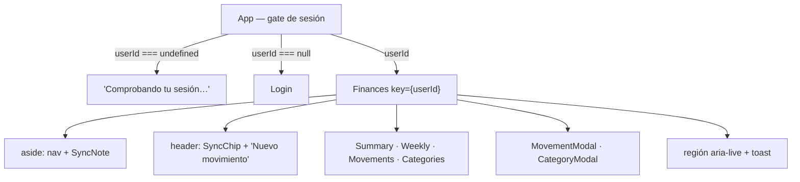

# Módulo: App (la UI entera)

`src/App.tsx` contiene el shell y **todas** las pantallas: `Summary`, `Weekly`, `Movements`,
`MovementModal`, `CategoryModal` y `Categories`. Solo los gráficos ([[charts]]), el login
([[supabase-auth]]) y el indicador de sync viven aparte.

**Fuente de verdad**: `src/App.tsx` · `src/SyncStatus.tsx` · `src/syncCopy.ts`

## Estructura



## El gate de sesión

Vive en su propio componente porque **los hooks de `Finances` no pueden ser condicionales**: sin sesión
ni siquiera se monta, así que tampoco se siembran las categorías por defecto antes de saber qué hay en
el servidor.

```ts
resolveUserId().then(id => setUserId(prev => prev === undefined ? id : prev));
return onAuthChange(setUserId);
```

El `prev === undefined` **es la carrera real**: si el usuario entra mientras `resolveUserId` sigue en
vuelo, `SIGNED_IN` ya habría fijado el id y la resolución inicial (`null`) lo pisaría devolviéndolo al
login. **La suscripción manda**; `resolveUserId` solo rellena el hueco inicial.

`key={userId}` en `Finances`: cambiar de usuario **remonta el árbol entero**, así ningún estado
sobrevive al cambio. → [[login]]

## Estado centralizado, sin store ni context

El ciclo es **siempre** el mismo:

```
escribir (sync.ts) → await reload() → reload() re-lee TODO con getAllData() → re-render
```

Es deliberadamente tonto y correcto para este volumen de datos. **No introduzcas estado optimista ni
caché sin un motivo medido.** Los hijos reciben datos y callbacks por props.

Tres detalles del arranque:

- **`reloadRef`** — el sync necesita recargar la pantalla cuando el pull trae algo, pero `reload` es una
  función nueva en cada render: capturarla directamente congelaría la primera. El ref siempre apunta a
  la vigente.
- **`dead`** — cubre el doble montaje de StrictMode, que en desarrollo ejecutaría `initSync` dos veces
  y dejaría sueltos los listeners del primero.
- **Las preferencias se guardan solas** con un efecto que observa `prefs`, y el guard `if(!loading)`
  evita sobrescribir lo que se cargó en el arranque. → [[preferencias]]

## Estado del sync en la UI

Un **único suscriptor** con `useSyncExternalStore(subscribeSyncState, getSyncState)`; de ahí baja por
props al `SyncChip` (cabecera) y al `SyncNote` (aside). `SyncStatus.tsx` **no importa `./sync` ni
`./supabase`**: el estado entra por props, así se testea sin montar el motor ni el cliente (que revienta
al importarse sin `.env.local`) y renderizar el indicador dos veces no duplica suscripciones.

El chip está en la cabecera **además** del aside porque el aside desaparece por debajo de 760 px, que es
justo el caso en el que saber si el móvil ha sincronizado importa más.

Los avisos salen de la **propia suscripción**, no de un efecto sobre `sync`: así se ve el estado
anterior y el nuevo sin compararlos entre renders. Solo se anuncia lo que **no** se deduce de la
pantalla —quedarse sin red, un sync fallido, la sesión caducada, un error irrecuperable— y **nunca** el
ciclo `syncing → idle` del sondeo de cada minuto. Reutiliza la región `aria-live` existente en vez de
crear una segunda.

## Páginas

- **`Summary`** — `PeriodBar` + 4 `Stat` (ingresos, gastos, ahorro, tasa) + 3 gráficos en `Suspense`.
- **`Weekly`** — la tabla gasto × semana. **Ignora `prefs.periodMode` a propósito** (siempre por mes),
  así navegar aquí no cambia el modo del Resumen; lo que sí comparte es `selectedDate`. Las celdas
  vacías se pintan como guion, no como "0,00 €": en una rejilla de 8 columnas los ceros tapan los
  importes reales.
- **`Movements`** — búsqueda por concepto/nota, filtro por tipo, orden por fecha descendente. Resolver
  el nombre de la categoría cae a `'Sin categoría'`.
- **`Categories`** — renombrar, archivar/activar, reordenar, añadir subcategoría (con `prompt()`) y la
  zona de peligro con "Borrar todo". → [[categorias]] · [[borrado-total]]

`pages` es la **fuente única** de `[id, icono, etiqueta, título]`: la usan el nav lateral, el nav móvil
y el `<h1>`, que antes repetían la misma lista tres veces.

## Modales

Los dos (`MovementModal`, `CategoryModal`) comparten el mismo patrón, y sus tres detalles son
intencionados:

- **El foco va al diálogo, no al primer input**: con `autoFocus` en el campo, el móvil abre el teclado
  nada más montar y empuja el formulario fuera de vista.
- **`body { overflow: hidden }`** mientras el modal está abierto: el teclado del móvil bloqueaba el
  scroll del fondo.
- **Dos efectos y no uno**: `onClose` cambia de identidad en cada render de `App`, así que si el foco
  viviera en el mismo efecto que el listener de `Escape` volvería al diálogo mientras se escribe.
  Rearmar solo el listener es inocuo.

Cierran con `Escape` y con clic en el backdrop (`onMouseDown` comparando `target === currentTarget`).
Llevan `role="dialog"`, `aria-modal` y `aria-labelledby`.

## Al añadir UI

- Estilo **denso**: sentencias encadenadas en una línea, cuerpos comprimidos. Imita el fichero.
- Copy en **español**; identificadores en inglés.
- Las escrituras van por las funciones `*Synced` de [[sync]], **nunca** por [[db]].
- Acciones destructivas confirman (borrar un movimiento: una; "Borrar todo": dos).
- No rompas la accesibilidad ya establecida → [[design-system]].

Related: [[sync]] · [[calculations]] · [[charts]] · [[design-system]] · [[preferencias]]
