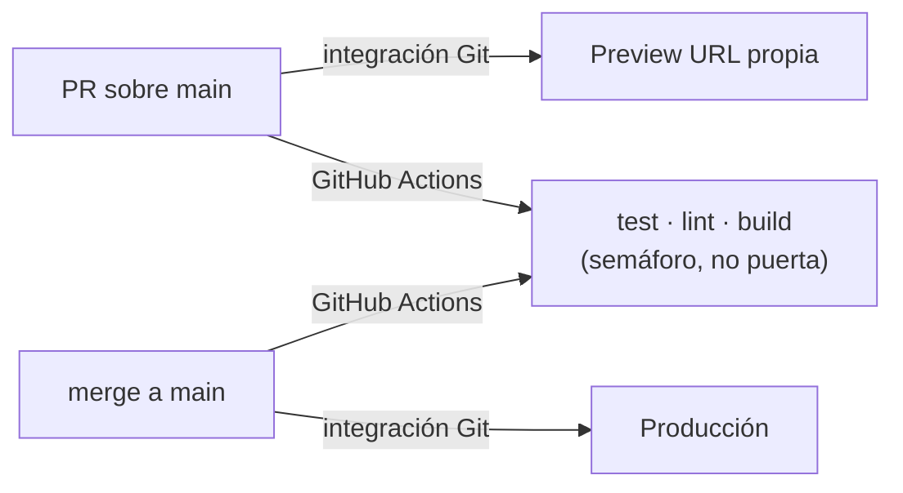

# Referencia: deploy en Vercel

Cómo se publica FinHub y qué hay configurado a mano en los dos dashboards. La decisión y sus
contrapartidas están en [[008-deploy-en-vercel]]; aquí está la mecánica.

**Fuente de verdad**: `vercel.json` · `.github/workflows/ci.yml` · `vite.config.ts` · dashboards de Vercel y Supabase

- **Producción**: `https://<pendiente>.vercel.app` ← rellenar con el dominio real
- **Repo**: `JoseCarlosCabelloTejero/FinHub` (privado), rama por defecto `main`

## Quién despliega qué

**Vercel despliega, Actions solo opina.** Un test rojo no bloquea el deploy; un error de tipos sí, porque
`tsc -b` vive dentro de `npm run build`. El porqué, en [[008-deploy-en-vercel]].

## Configuración de build

Todo en `vercel.json`, **no en el dashboard**, para que el proyecto se pueda recrear:

| Ajuste | Valor | Por qué |
|---|---|---|
| `framework` | `vite` | preset de detección |
| `installCommand` | **`npm ci`** | las dependencias son `"latest"`: el pin real es `package-lock.json` |
| `buildCommand` | `npm run build` | incluye el `tsc -b` |
| `outputDirectory` | `dist` | default de Vite, explícito |
| `headers` | 4 cabeceras de seguridad | `nosniff`, `DENY`, `Referrer-Policy`, `Permissions-Policy` |

⚠️ **No poner el install en modo producción** (`--omit=dev`): `vite.config.ts` importa `defineConfig` de
`vitest/config`, así que **vitest hace falta en tiempo de build** aunque sea devDependency.

Sin CSP todavía: con Supabase y los estilos de Vite hay que afinarla y merece su propio paso.
Sin rewrite catch-all: no hay router, un 404 real es la respuesta correcta.

## Variables de entorno

Las mismas dos de siempre (`VITE_SUPABASE_URL`, `VITE_SUPABASE_ANON_KEY`), en **Production, Preview y
Development** del proyecto de Vercel. → [[comandos-y-entorno]]

- **Vite las inlinea en tiempo de build**, no se leen en runtime: cambiarlas exige **redeploy**, no basta
  con guardar.
- Son **públicas por diseño**: viajan en el bundle y las protege la RLS. La *service role key* no entra
  nunca aquí. → [[postgres-schema]]
- `vite.config.ts` lleva un plugin (`finhub:require-supabase-env`, `apply: 'build'`) que **aborta el
  build** si falta alguna, o si la URL trae un sufijo `/rest/v1`. Sin él el build pasa y producción sale en
  **pantalla en blanco** con el error solo en consola.
- **En CI se pasan valores dummy** a propósito: el workflow solo type-checkea y GitHub no necesita ningún
  secreto. Los tests ya mockean `./supabase`.

## ⚙️ Configuración manual (no versionable)

### Vercel

1. Importar el repo desde *Add New → Project*. Plan Hobby: despliega repos privados de cuentas personales.
2. Las dos variables de entorno en los tres entornos (arriba).
3. Node.js Version: `package.json` declara `engines.node: ">=20"`, que **es lo que Vercel lee** — `.nvmrc`
   solo lo usan el CI (verificado: `actions/setup-node` resuelve `20` → 20.20.2) y el entorno local. El
   rango abierto es deliberado: Vercel construye con su versión por defecto, que puede ser mayor que 20, y
   un build de Vite no es sensible a esa diferencia. Si en algún momento se quiere que CI y producción
   corran exactamente lo mismo: `nvm install <v>`, `.nvmrc` → `<v>` y ajustar el "Node.js 20+" de los docs.

### Supabase

Además de lo que ya lista [[supabase-auth]] (signup OFF, confirm email OFF, usuario propietario creado):

1. *Authentication → URL Configuration* → **Site URL** = el dominio de producción. Con login por
   contraseña no hay correos con enlace, así que no hace falta lista de redirects.
2. **Settings → API → Max rows = `100000`**, replicando `supabase/config.toml`. Si se queda en el default
   (1000) **el pull trunca sin avisar** y parecerá que faltan movimientos: el sync hace una lectura completa
   sin paginar. Es la trampa más silenciosa del deploy. → [[pull]]

## Instalación en el móvil

`public/manifest.webmanifest` + iconos hacen que se pueda añadir a la pantalla de inicio y abra sin barra
de navegador (`display: standalone`). Los iconos se generan del glifo `WalletCards` de lucide, el mismo de
la marca en el aside, con los tokens de `src/theme.ts`. → [[design-system]]

**No hay service worker**: el *shell* necesita red para cargar. Los **datos** sí funcionan sin conexión,
porque viven en IndexedDB. → [[escritura-local]]

Para regenerar los PNG desde `public/favicon.svg` no hace falta instalar nada (Chrome headless
`--screenshot --window-size` + `sips -z` para reescalar). El `apple-touch-icon` lleva fondo sólido porque
iOS ignora la transparencia y la pinta en negro.

## Operación

- **Rollback**: Deployments → el anterior → *Promote to Production*. No hace falta tocar git.
- **Ver por qué falló un build**: Deployments → el fallido → Building. El guard de variables aparece ahí
  como `Build abortado: falta ...`.
- **El free tier de Supabase pausa proyectos inactivos.** Si un día no se puede entrar y el login da error
  de red, es lo primero que mirar en el dashboard.

Related: [[008-deploy-en-vercel]] · [[comandos-y-entorno]] · [[supabase-auth]] · [[qa-playbook]]
