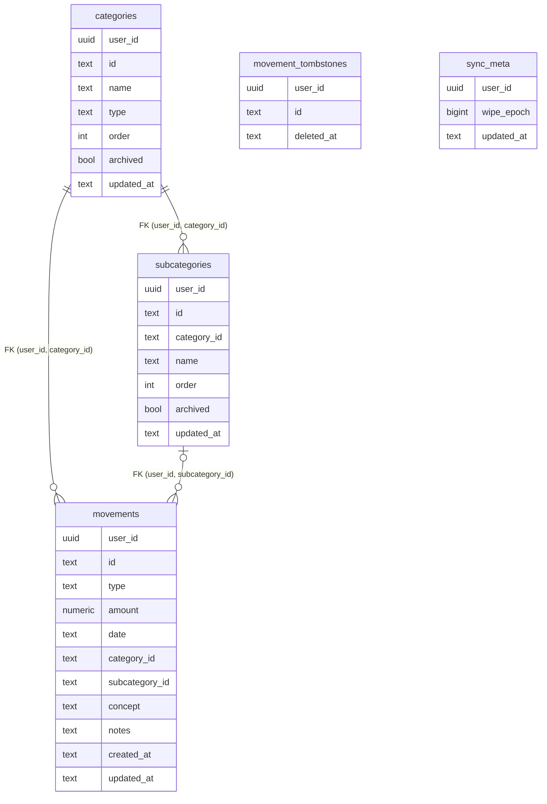

# Referencia: esquema de Postgres

**Fuente de verdad**: `supabase/migrations/20260808133140_schema.sql` (531 líneas, muy comentadas — esta
nota es el mapa, no un sustituto).

## Premisas que atraviesan todo el esquema

1. **Todos los timestamps y fechas son `text`, nunca `timestamptz`.** El cliente los produce con
   `toISOString()` (ancho fijo, siempre UTC), y guardarlos tal cual garantiza round-trip byte a byte y
   que **comparación lexicográfica == comparación cronológica**, que es de lo que depende toda la lógica
   LWW. Un `timestamptz` los reformatearía y rompería esa equivalencia. → [[002-lww-con-updated-at-text]]
2. **`collate "C"`** en esas columnas, para que `<=` sea comparación de bytes pura, independiente del
   `lc_collate` de la base.
3. **Los IDs los genera el cliente** (slugs estables para el árbol por defecto, uuid v4 para lo creado a
   mano) y se conservan como PK: la subida inicial y el push son upserts ciegos e idempotentes.
4. **La PK es SIEMPRE `(user_id, id)`, no `id`.** Dos usuarios comparten los mismos slugs por defecto
   (`income`, `expense-coche`), así que una PK solo sobre `id` colisionaría entre usuarios y el
   `ON CONFLICT DO UPDATE` de PostgREST intentaría actualizar la fila del otro.
5. **El cliente nunca manda `user_id`**: la columna tiene `DEFAULT auth.uid()`.

## Tablas



### De datos

| Tabla | Notas |
|---|---|
| `categories` | `check type in ('income','expense')` · `"order"` entrecomillado (palabra reservada) |
| `subcategories` | Normalizadas aquí, embebidas en el cliente → [[007-subcategorias-normalizadas-en-servidor]] |
| `movements` | `numeric(12,2)`, `check amount >= 0`, checks de formato ISO en `date`/`created_at`/`updated_at` |

Detalles de las FK de `movements` que costaron un rato:

- **La FK incluye `user_id`**: impide colgar una subcategoría de la categoría de otro usuario aunque los
  ids coincidan (los slugs por defecto **sí** coinciden).
- **`MATCH SIMPLE`** (el default) en la FK de subcategoría: si `subcategory_id` es `NULL` la restricción
  se da por satisfecha sin mirar `user_id`. `MATCH FULL` exigiría que **todas** las columnas fuesen NULL
  a la vez y, como `user_id` es `NOT NULL`, rechazaría cualquier movimiento sin subcategoría.
- **`on delete set null (subcategory_id)`** con lista de columnas (Postgres 15+): un `set null` a secas
  sobre una FK compuesta pondría a NULL **también** `user_id`, que es `NOT NULL`, y el borrado fallaría.
  Además conserva el movimiento, en línea con "archivar preserva el histórico".
- **`check (subcategory_id is null or subcategory_id <> '')`**: sin él, un `''` que se cuele produce un
  `23503` desconcertante. El cliente mapea `''` → `null`. → [[sync]]

### Server-only

- **`movement_tombstones`** — lápidas de movimientos borrados. **Sin ningún grant** para
  `anon`/`authenticated` y sin políticas. Solo la tocan los triggers `SECURITY DEFINER` y el RPC de wipe.
  **No referencia `auth.users` a propósito**: el trigger `AFTER DELETE` inserta aquí mientras el borrado
  en cascada de un usuario está en curso, y una FK haría fallar `delete from auth.users`.
- **`sync_meta`** — el contador `wipe_epoch`. El cliente lo **lee** (vía RPC) pero no lo escribe.

## Índices — deliberadamente pocos

- **No hay índice sobre `user_id`**: es la columna **líder** de todas las PK, así que el pull completo
  (`where user_id = ...`) ya usa el índice de la PK.
- **No hay índice por `date`/`type`/`updated_at`**: el pull se trae la tabla entera y la UI filtra en
  memoria. Añadirlo sería coste de escritura sin lector. *(Si algún día se hace pull incremental,
  entonces sí: `movements (user_id, updated_at)`.)*
- **Sí** están los del lado hijo de cada FK (`subcategories_category_idx`, `movements_category_idx`,
  `movements_subcategory_idx`): sin ellos, cada `CASCADE`/`SET NULL` haría un seq scan por fila padre.

## Los tres triggers

### 1. LWW — `discard_stale_write()` (BEFORE UPDATE, las 3 tablas)

```sql
if (new.updated_at collate "C") <= old.updated_at then return null;
```

- **`RETURN NULL`, no `RETURN OLD`**: en un trigger BEFORE FOR EACH ROW, devolver NULL **cancela** la
  operación en silencio. Con `RETURN OLD` la fila se reescribiría (tupla muerta, evento en el WAL,
  triggers AFTER disparados) — todo ruido con cero valor.
- **`<=` y no `<`**: el empate se descarta, y eso es justo lo que hace idempotente el reintento del
  outbox tras un fallo de red.
- Una sola función genérica para las tres tablas (`NEW` se resuelve en tiempo de ejecución).
  Contrapartida: colgarla de una tabla sin `updated_at` compila bien y **peta al disparar**.

### 2. Anti-resurrección — `block_resurrected_movement()` (BEFORE INSERT en `movements`)

Escenario: B edita el movimiento M sin conexión, A lo borra y pushea, B pushea después. Como la fila ya
no existe, el upsert de B entra por la rama **INSERT** y el trigger de LWW (BEFORE UPDATE) **no se
ejecuta**: M resucitaría. Aquí se compara contra la lápida, y **ante empate gana el borrado** (`>=`).

`SECURITY DEFINER` es **obligatorio**: `authenticated` no tiene grants sobre `movement_tombstones`. Y
como definer corre como `postgres`, que **salta la RLS**, el filtro `t.user_id = new.user_id` es carga
estructural, no decorativa: es lo único que impide mirar las lápidas de otro usuario.

### 3. Lápidas automáticas — `record_movement_tombstone()` (AFTER DELETE en `movements`)

En servidor y no en cliente: el cliente puede quedarse sin batería entre el DELETE y el INSERT de la
lápida, y necesitaría permisos sobre la tabla que precisamente queremos aislarle. Aquí es atómico y cubre
**toda** vía de borrado (cliente, cascada, psql).

- `greatest(old.updated_at, iso_now())` — el reloj del servidor puede ir por detrás del dispositivo, y
  así el borrado siempre gana a la versión que borró.
- `on conflict … do update set deleted_at = greatest(...)` — un id puede borrarse más de una vez
  (borrar → recrear → borrar); sin esto el segundo DELETE fallaría por PK duplicada.

## RLS y grants

**`enable`, no `force`.** `force row level security` sujetaría también al **owner** a las políticas, y eso
rompería el diseño: los triggers `SECURITY DEFINER` y el RPC de wipe corren como `postgres` sobre
`movement_tombstones`, que no tiene **ni una** política → todo denegado. **El bypass del owner es la
pieza que hace que "server-only" funcione.**

Las políticas están **separadas por operación** (no un `for all`) para que se vea de un vistazo que
`SELECT`/`DELETE` solo tienen `USING` y que `INSERT`/`UPDATE` tienen `WITH CHECK` — la parte que de verdad
sostiene el modelo: sin ella, un payload con `user_id` ajeno se colaría pese al DEFAULT.

| Tabla | Políticas | Grants a `authenticated` |
|---|---|---|
| `categories` | select · insert · update | select, insert, update |
| `subcategories` | select · insert · update | select, insert, update |
| `movements` | select · insert · update · **delete** | select, insert, update, delete |
| `sync_meta` | select | select |
| `movement_tombstones` | **ninguna** | **ninguno** |

- **Sin política DELETE en categorías/subcategorías a propósito**: se archivan, nunca se borran.
  → [[005-categorias-se-archivan]]
- **`(select auth.uid())`** en vez de `auth.uid()`: el planificador lo convierte en un InitPlan evaluado
  **una vez por consulta** en lugar de una por fila.
- **`to authenticated`** evita que la política se evalúe siquiera para `anon`. Si `auth.uid()` es NULL la
  comparación da NULL → denegado: **falla cerrado**.
- El `REVOKE ALL` explícito previo hace que el fichero se comporte igual en proyectos nuevos y en
  antiguos (que conservan un `ALTER DEFAULT PRIVILEGES` que expone las tablas solas).

## Funciones

| Función | Tipo | Para qué |
|---|---|---|
| `iso_now()` | stable, invoker | "Ahora" con el formato **exacto** de `toISOString()` |
| `current_wipe_epoch()` | stable, invoker | Lee el epoch; devuelve 0 si no hay fila (evita un `PGRST116`) |
| `wipe_all_data()` | **definer** | Borrado total; devuelve el nuevo epoch → [[borrado-total]] |

Postgres concede `EXECUTE` a `PUBLIC` en toda función nueva, así que el fichero **revoca antes de
conceder**. Crítico en `wipe_all_data()`, que es `SECURITY DEFINER`. Las funciones de trigger no se
blindan porque Postgres se niega a ejecutarlas fuera de un trigger.

## Reglas para el cliente (las 8 notas del final del SQL)

1. `amount` llega como **número JSON** (PostgREST usa `to_json`): **no hacer `parseFloat`**.
2. **No mandar `user_id`** en el payload: aplica el DEFAULT.
3. **No encadenar `.select()`** al `.upsert()`: sin él la respuesta es 201 vacía y una fila descartada por
   LWW es indistinguible de una aplicada — que es lo que queremos en un push ciego.
4. `Category` y sus subcategorías necesitan `updatedAt`, y hay que **bumpearlo en toda mutación**
   (renombrar, archivar, reordenar, añadir).
5. `updated_at` **monótono por dispositivo** → `monotonicStamp` en [[sync]].
6. `subcategoryId`: el modal usa `value=""` → mapear `''` a `null`.
7. **Antes de cada push, leer `current_wipe_epoch()`**: un wipe purga las lápidas, así que el trigger
   anti-resurrección no protege ahí.
8. `"order"` choca con el parámetro reservado `order` de PostgREST: **no se puede filtrar por él vía
   API**. Inofensivo, la UI ordena en JS.

## Migraciones

Una sola por ahora: `20260808133140_schema.sql`. Termina con `notify pgrst, 'reload schema'`, necesario
en un `db push` remoto (`db reset` ya lo hace). Para trabajar en local ver [[comandos-y-entorno]].

Related: [[sync-model]] · [[sync]] · [[borrado-total]] · [[supabase-auth]] · [[comandos-y-entorno]]
